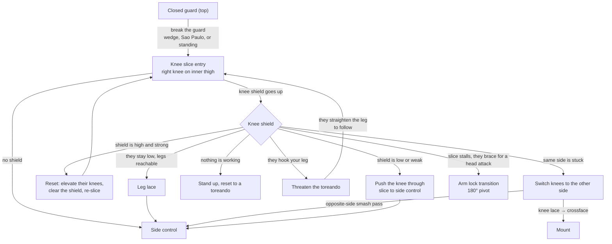

# The Knee Slice Chain

**Guard break → Knee slice → Knee shield encountered → Response → Side control or mount**

The knee slice is the highest-percentage pass in this reference. Almost everyone defends it with a knee shield, so the chain is really about what you do when the shield goes up — there are five answers, and each one is chosen by how the opponent is defending.

## Where each step lives

- Breaking the guard: [Passing Closed Guard](../positions/02-closed-guard.md#25-passing-closed-guard); the entry itself: [Closed Guard to Knee Slice](../positions/02-closed-guard.md#closed-guard-to-knee-slice)
- Mechanics, weight distribution, the safety rule: [The Knee Slice](../positions/04-half-guard-top.md#42-the-knee-slice)
- The five answers to the shield: [Defeating the Knee Shield](../positions/04-half-guard-top.md#43-defeating-the-knee-shield) — [push through](../positions/04-half-guard-top.md#approach-1-push-the-knee-through), [reset](../positions/04-half-guard-top.md#approach-2-the-reset), [threaten the toreando](../positions/04-half-guard-top.md#approach-3-threaten-the-toreando), [leg lace](../positions/04-half-guard-top.md#approach-4-the-leg-lace), [stand up](../positions/04-half-guard-top.md#approach-5-stand-up)
- Switching sides: [Switching the Knees](../positions/04-half-guard-top.md#44-switching-the-knees--passing-to-the-opposite-side) → [opposite-side smash pass](../positions/04-half-guard-top.md#the-opposite-side-smash-pass) or [knee lace to mount](../positions/04-half-guard-top.md#the-knee-lace-to-mount)
- The arm lock: [The Knee Slice to Arm Lock Transition](../positions/04-half-guard-top.md#47-the-knee-slice-to-arm-lock-transition)
- Landing: [Side Control](../positions/06-side-control.md), [Mount](../positions/07-mount.md)
