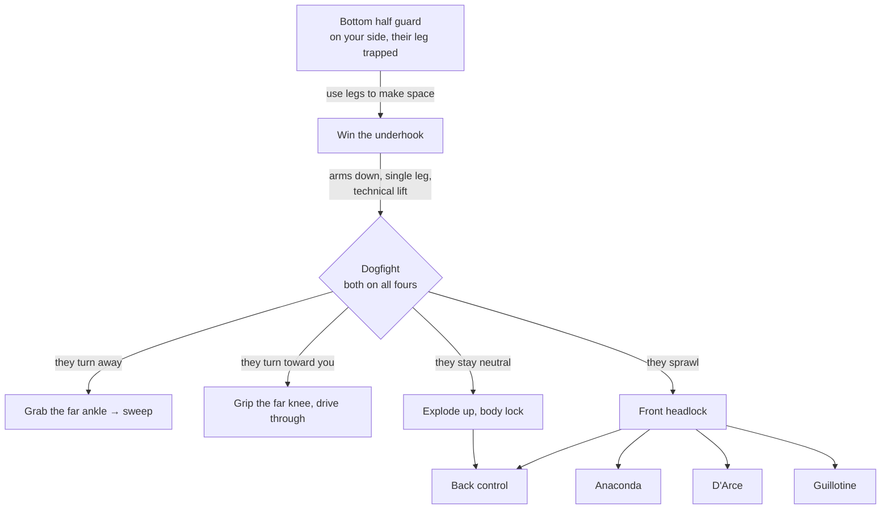

# The Half Guard Wrestle-Up Chain

**Bottom half guard → Underhook → Wrestle-up → Dogfight → Front headlock system**

The main offensive line from bottom half guard. Win the underhook, get to your knees, and you arrive in the dogfight — where the opponent's choice of defense picks your finish. If they sprawl on you, the chain hands off to the front headlock system.

## Where each step lives

- Surviving first: [Framing and Survival](../positions/03-half-guard-bottom.md#32-framing-and-survival)
- Winning the underhook: [The Underhook Battle](../positions/03-half-guard-bottom.md#34-the-underhook-battle)
- Getting up and the dogfight branches: [The Wrestle-Up](../positions/03-half-guard-bottom.md#35-the-wrestle-up) → [Dogfight Options](../positions/03-half-guard-bottom.md#dogfight-options), [The Full Wrestle-Up Sequence](../positions/03-half-guard-bottom.md#the-full-wrestle-up-sequence)
- After the sprawl: [The Front Headlock Position](../positions/09-front-headlock.md#91-the-front-headlock-position) → [Anaconda](../positions/09-front-headlock.md#92-the-anaconda-choke), [D'Arce](../positions/09-front-headlock.md#93-the-darce-choke), [Guillotine](../positions/09-front-headlock.md#94-the-guillotine), [to the back](../positions/09-front-headlock.md#transition-to-back-control-from-front-headlock)
- Everything after the sprawl, as its own chain: [The Front Headlock System](12-front-headlock.md)
- What the top player is doing to stop this: [Countering the Underhook Escape](../positions/04-half-guard-top.md#49-countering-the-underhook-escape)
