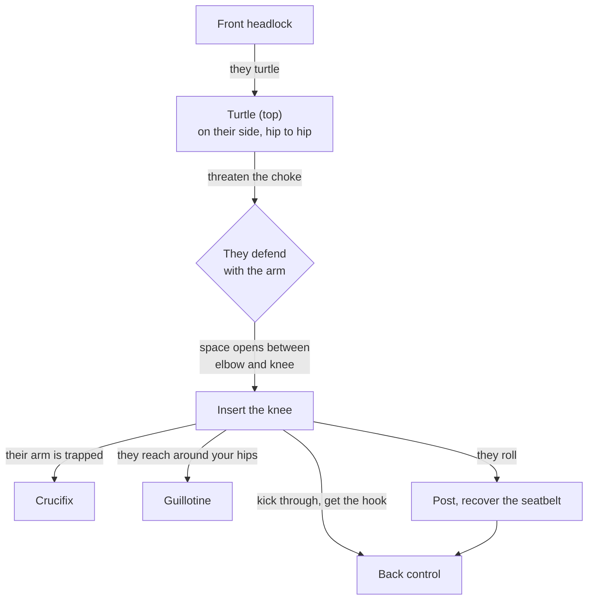

# The Turtle Attack Chain

**Front headlock → Opponent turtles → Choke threat → Knee insertion → Attacks**

When an opponent turtles to escape the front headlock, threatening the choke makes them defend with an arm — and the space that opens is where your knee goes. Everything after the knee insertion is decided by what they do with that space.

## Where each step lives

- Don't overreach: [The Golden Rule](../positions/10-turtle.md#101-the-golden-rule-do-not-overreach), [The Starting Position](../positions/10-turtle.md#102-the-starting-position)
- The key move: [The Knee Insertion](../positions/10-turtle.md#103-the-knee-insertion)
- Branches: [The Crucifix](../positions/10-turtle.md#the-crucifix), [The Guillotine](../positions/10-turtle.md#the-guillotine), [The Primary Back Take from Turtle](../positions/10-turtle.md#105-the-primary-back-take-from-turtle), [The Granby Roll Defense](../positions/10-turtle.md#the-granby-roll-defense)
- If they roll: [Isolating the Far Arm](../positions/10-turtle.md#isolating-the-far-arm)
- Getting here from the headlock: [Transitioning from Front Headlock to Turtle Attack](../positions/10-turtle.md#transitioning-from-front-headlock-to-turtle-attack)
- Finishing on the back: [The Primary Back Take from Turtle](../positions/10-turtle.md#105-the-primary-back-take-from-turtle), [Submissions from the Back](../positions/08-back-control.md#84-submissions-from-the-back)
