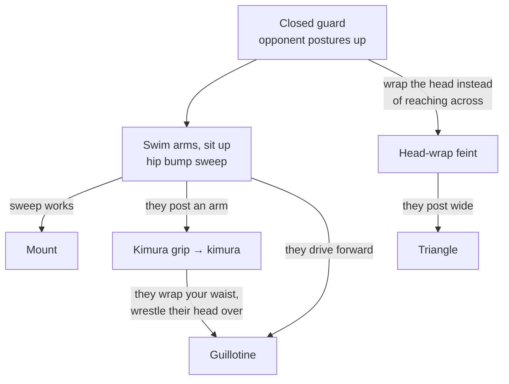

# The Closed Guard Attack Chain

**Hip bump sweep → Kimura → Guillotine (→ Triangle)**

From closed guard, one sweep attempt sets up three finishes, and a feint on the same movement sets up a fourth. Which one you get depends entirely on how your opponent defends the sweep.

## Where each step lives

- Setup and sweep: [The Hip Bump Sweep](../positions/02-closed-guard.md#the-hip-bump-sweep)
- They post → [The Kimura Trap](../positions/02-closed-guard.md#the-kimura-trap); finishing mechanics in [Submissions § Kimura](../submissions.md#113-kimura)
- They drive forward → [The Hip Bump to Guillotine](../positions/09-front-headlock.md#the-hip-bump-to-guillotine); finishing mechanics in [Submissions § Guillotine](../submissions.md#116-guillotine)
- The feint → [The head-wrap variation](../positions/02-closed-guard.md#the-hip-bump-sweep), then [The Triangle](../positions/02-closed-guard.md#the-triangle)
- Sweep lands → [Mount](../positions/07-mount.md)
