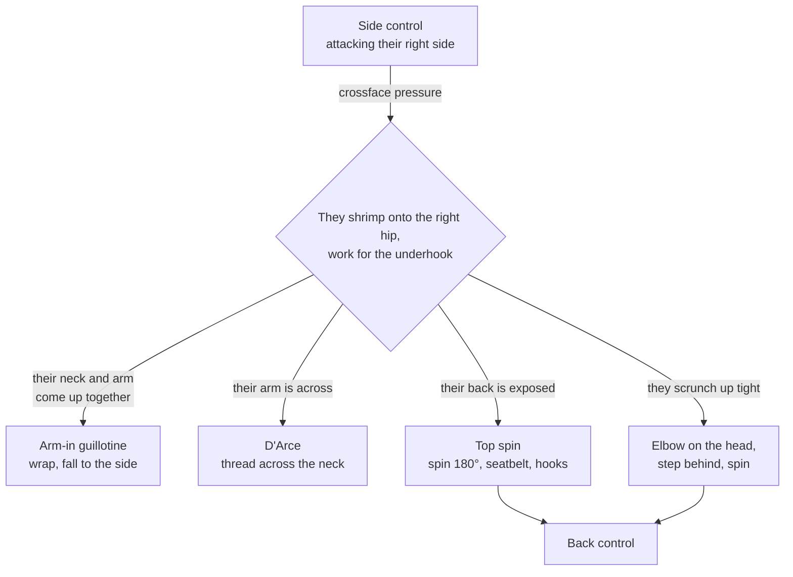

# The Side Control Pressure Chain

**Side control → Opponent shrimps → Submission or back take**

Side control is a transit point, not a destination. Pressure makes the opponent shrimp onto their hip and hunt for the underhook — and that shrimp is the trigger for every attack in this chain.

## Where each step lives

- Holding the position first: [Maintaining Side Control](../positions/06-side-control.md#61-maintaining-side-control) → [The Crossface](../positions/06-side-control.md#the-crossface)
- Submissions: [The Arm-In Guillotine](../positions/06-side-control.md#the-arm-in-guillotine), [The D'Arce Choke](../positions/06-side-control.md#the-darce-choke); finishing mechanics in [Submissions § Guillotine](../submissions.md#116-guillotine) and [§ Anaconda and D'Arce](../submissions.md#117-anaconda-and-darce)
- The back take: [Side Control to Back — The Top Spin](../positions/06-side-control.md#side-control-to-back--the-top-spin)
- If none of it opens up, keep moving: [The Carving System](../positions/06-side-control.md#the-carving-system) (its own [chain](10-carving-system.md)), [Side Control to Mount](../positions/06-side-control.md#side-control-to-mount), [Side Control to North-South](../positions/06-side-control.md#side-control-to-north-south)
- From the other side of it: [Escaping Side Control](../positions/06-side-control.md#64-escaping-side-control-from-the-bottom)
