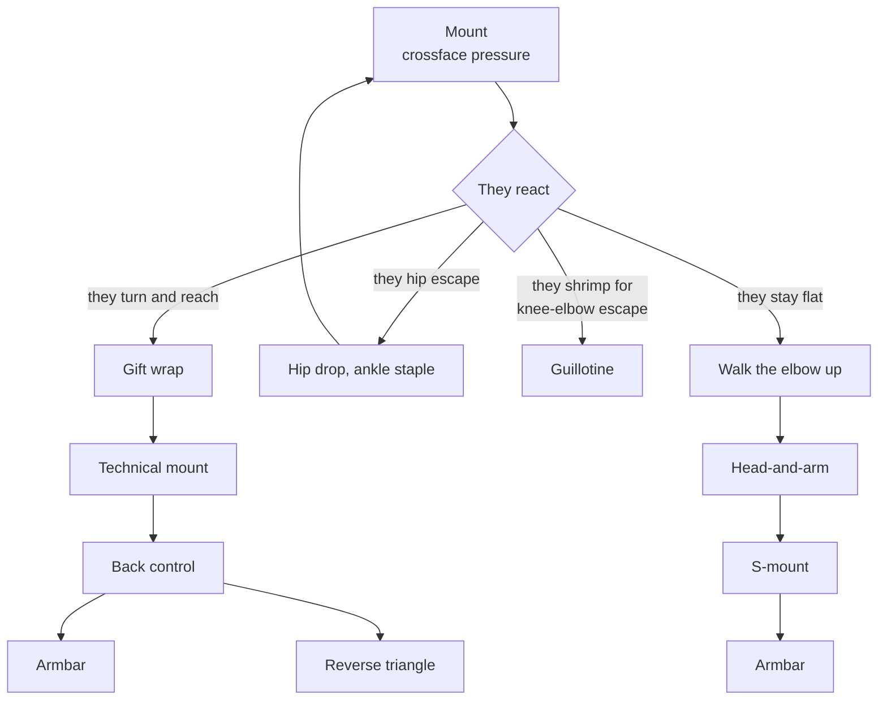

# The Mount Submission Chain

**Mount → Pressure → They react → Submission or back take**

You don't force a submission on a flat, defensive opponent in mount. You make them uncomfortable enough to move, and then each way they can move has an answer.

## Where each step lives

- The principle: [Making Them React](../positions/07-mount.md#71-making-them-react) → [The Crossface Pressure](../positions/07-mount.md#the-crossface-pressure), [What Happens When They React](../positions/07-mount.md#what-happens-when-they-react)
- They turn: [The Gift Wrap to Back Control](../positions/07-mount.md#the-gift-wrap-to-back-control); then [The Reverse Triangle from Back Control](../positions/08-back-control.md#the-reverse-triangle-from-back-control)
- They hip escape: [The Hip Escape Counter](../positions/07-mount.md#the-hip-escape-counter), [The Quarter Guard Recovery](../positions/07-mount.md#the-quarter-guard-recovery)
- They shrimp: [The Guillotine from Mount](../positions/07-mount.md#the-guillotine-from-mount)
- They stay flat: [The Head and Arm Choke to Armbar](../positions/07-mount.md#the-head-and-arm-choke-to-armbar), [Breaking Armbar Defenses](../positions/07-mount.md#breaking-armbar-defenses)
