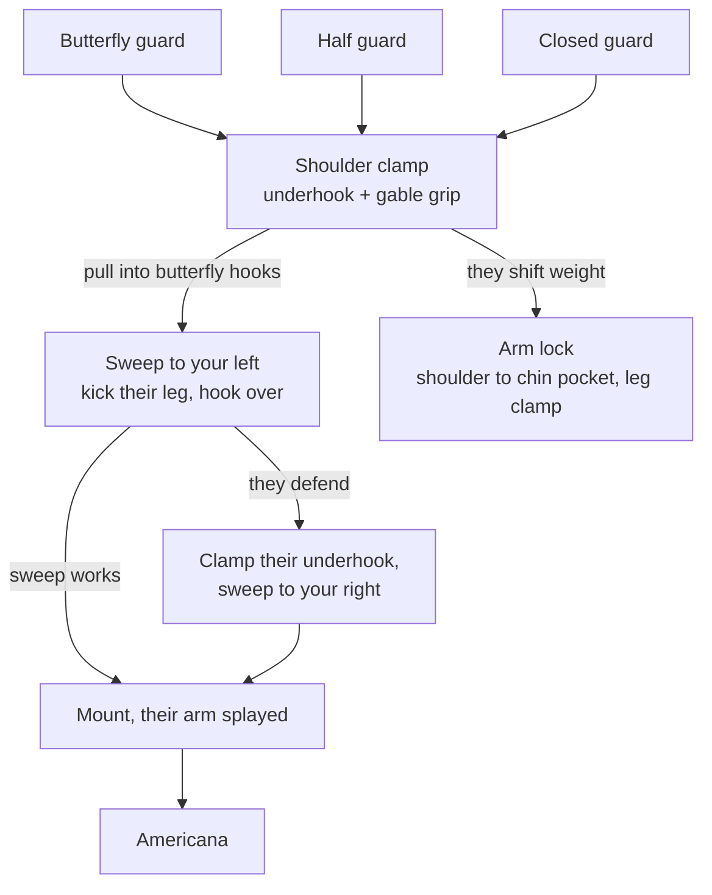

# The Shoulder Clamp Chain

**Butterfly / half guard / closed guard → Shoulder clamp → Sweep or arm lock**

One grip — underhook plus a gable grip clamping their shoulder — that you can reach from three guards. Both sweeps land in the same finishing position, so the opponent's defense to the first sweep sets up the second.

## Where each step lives

- The system: [The Shoulder Clamp System](../positions/05-open-guards.md#52-the-shoulder-clamp-system) → [entering from butterfly](../positions/05-open-guards.md#entering-the-shoulder-clamp-from-butterfly-guard)
- The two sweeps: [to your left](../positions/05-open-guards.md#the-shoulder-clamp-sweep-to-your-left), [to your right](../positions/05-open-guards.md#the-shoulder-clamp-sweep-to-your-right)
- The arm lock: [The Shoulder Clamp to Arm Lock](../positions/05-open-guards.md#the-shoulder-clamp-to-arm-lock)
- Other entries: [from closed guard](../positions/02-closed-guard.md#the-shoulder-clamp-from-closed-guard), [from half guard](../positions/03-half-guard-bottom.md#the-shoulder-clamp-to-arm-lock)
- Finishing: [Submissions § Americana](../submissions.md#114-americana)
