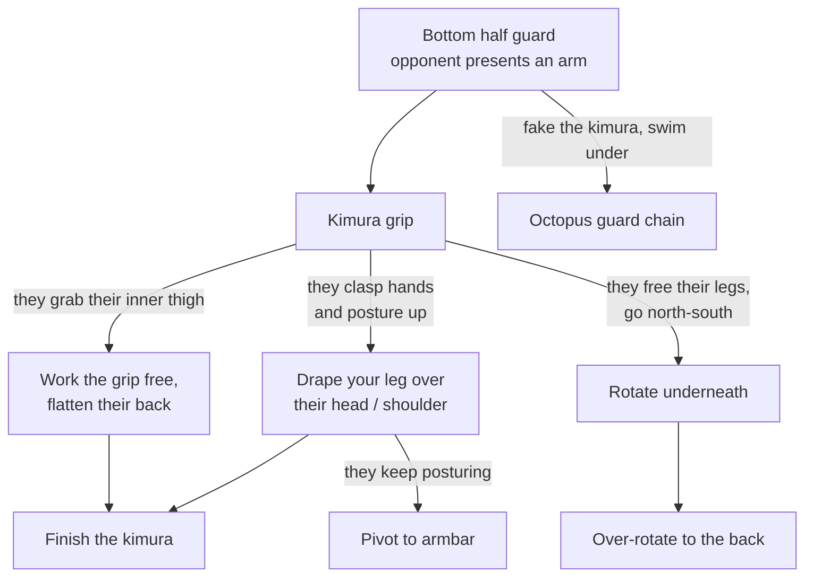

# The Kimura Trap Chain

**Half guard bottom → Kimura grip → Opponent defends → Counters**

Once the kimura grip is locked from bottom half guard, every common defense has a counter — including the one where they escape to north-south, which you can bait on purpose.

## Where each step lives

- The whole system: [The Kimura Trap System](../positions/03-half-guard-bottom.md#the-kimura-trap-system)
- Finishing mechanics and defenses: [Submissions § Kimura](../submissions.md#113-kimura), [§ Armbar](../submissions.md#111-armbar)
- Same grip from other positions: [The Kimura Trap](../positions/02-closed-guard.md#the-kimura-trap) (closed guard), [The Kimura from Side Control](../positions/06-side-control.md#the-kimura-from-side-control)
- Where the back take lands: [Back Control](../positions/08-back-control.md)
- The kimura threat as an entry to something else: [The Octopus Guard Chain](11-octopus-guard.md)
