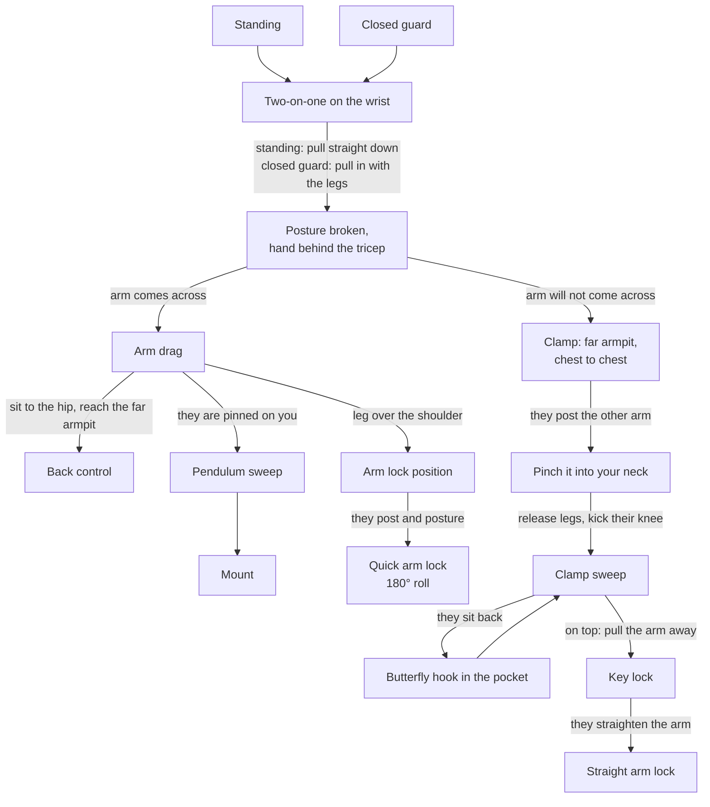

# The Arm Drag Chain

**Two-on-one → Break posture → Drag (or clamp) → Back take, sweep, or arm lock**

One grip on one wrist becomes control of the whole body. The first fork is whether the arm will come across their center line at all; every branch after that is chosen by how they try to free it.

## Where each step lives

- The principle, the two-on-one, breaking posture, head placement: [The Two-on-One and the Arm Drag](../positions/01-foundations.md#17-the-two-on-one-and-the-arm-drag)
- Closed guard drag and back take: [The Arm Drag to Back Control](../positions/02-closed-guard.md#the-arm-drag-to-back-control); landing in [Back Control](../positions/08-back-control.md#from-closed-guard-arm-drag)
- Sweep branch: [The Arm Drag to Pendulum Sweep](../positions/02-closed-guard.md#the-arm-drag-to-pendulum-sweep)
- Arm lock branch: [The Arm Drag to Arm Lock](../positions/02-closed-guard.md#the-arm-drag-to-arm-lock)
- The clamp, the sweep, the sit-back counter, and the key lock on top: [When the Drag Will Not Come Across: The Clamp Sweep](../positions/02-closed-guard.md#when-the-drag-will-not-come-across-the-clamp-sweep); finishing in [Submissions § Americana](../submissions.md#114-americana)
