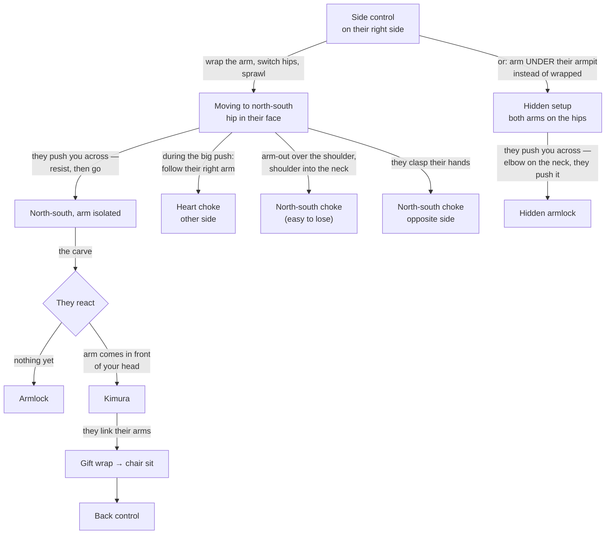

# The Carving System Chain

**Side control → Wrap the arm, switch hips, sprawl → North-south → They push → Finish**

Side control is a way station. The carving system leaves it toward north-south with one arm isolated, and every finish is chosen by what the opponent does about that arm.

## Where each step lives

- Everything above, in order: [The Carving System](../positions/06-side-control.md#the-carving-system)
- The simpler transition it builds on: [Side Control to North-South](../positions/06-side-control.md#side-control-to-north-south)
- Heart choke finishing: [The Heart Choke from Side Control](../positions/06-side-control.md#the-heart-choke-from-side-control), [Submissions § Heart Choke](../submissions.md#1110-heart-choke)
- Kimura and armbar mechanics: [Submissions § Kimura](../submissions.md#113-kimura), [§ Armbar](../submissions.md#111-armbar)
- North-south choke: [Submissions § North-South Choke](../submissions.md#1112-north-south-choke)
- The chair sit and the back: [Transitioning to Technical Mount / Chair Sit](../positions/08-back-control.md#transitioning-to-technical-mount--chair-sit)
