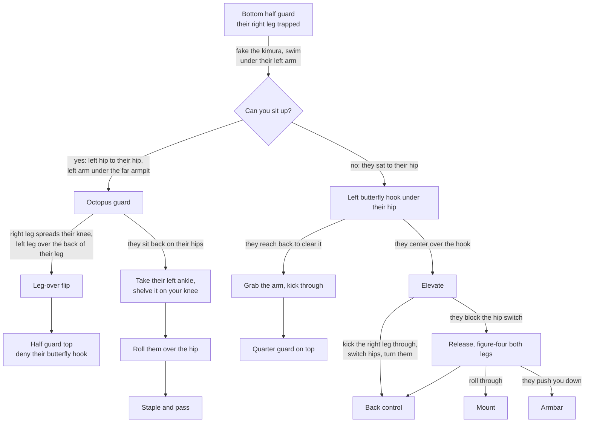

# The Octopus Guard Chain

**Bottom half guard → Kimura threat → Swim under, sit up, armpit grip → Sweep to top or take the back**

Two sit-up attacks from bottom half guard that share an entry — the kimura threat — and share a rule: reach back for the far armpit or get crossfaced. The butterfly hook version is what happens when they keep you flat.

## Where each step lives

- The entry, the armpit grip, both sweeps: [The Octopus Guard](../positions/03-half-guard-bottom.md#the-octopus-guard)
- The hook and its three branches: [The Butterfly Hook Surprise](../positions/03-half-guard-bottom.md#the-butterfly-hook-surprise)
- The kimura threat the entry is faked from: [The Kimura Trap System](../positions/03-half-guard-bottom.md#the-kimura-trap-system)
- The same leg-over idea against a stapler: [The Staple Pass](../positions/03-half-guard-bottom.md#the-staple-pass)
- Where you land: [Half Guard Top](../positions/04-half-guard-top.md), [Back Control](../positions/08-back-control.md), [Mount](../positions/07-mount.md)
