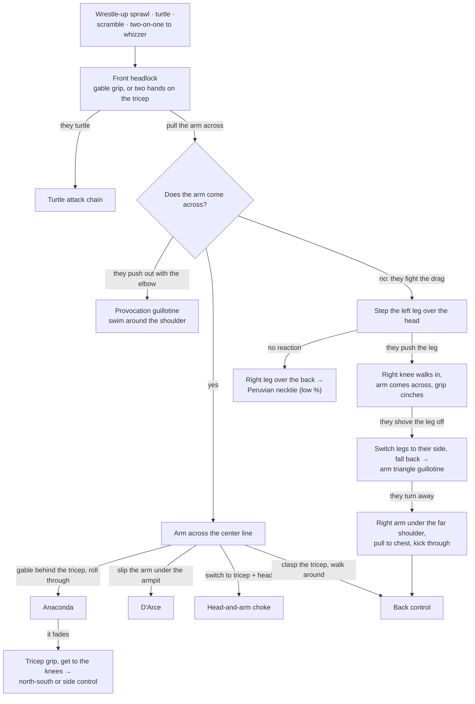

# The Front Headlock System

**Front headlock → Drag the arm across → Anaconda, D'Arce, head-and-arm, guillotine, or the back**

Everything from the front headlock runs through one question: does their arm come across their center line? If it does, you choose the finish. If they fight it, you threaten something else until it does. If they turtle, the [turtle attack chain](03-turtle-attack.md) takes over.

## Where each step lives

- The position and entries: [The Front Headlock Position](../positions/09-front-headlock.md#91-the-front-headlock-position)
- Winning the arm with the step-over, the arm triangle guillotine, and the back take when they turn: [Winning the Arm: The Step-Over](../positions/09-front-headlock.md#winning-the-arm-the-step-over)
- Anaconda: [setup](../positions/09-front-headlock.md#92-the-anaconda-choke), [when it does not finish](../positions/09-front-headlock.md#when-the-anaconda-does-not-finish)
- D'Arce: [from the front headlock](../positions/09-front-headlock.md#setup-from-the-front-headlock)
- Guillotine: [the provocation guillotine](../positions/09-front-headlock.md#the-provocation-guillotine-from-front-headlock); finishing in [Submissions § Guillotine](../submissions.md#116-guillotine)
- Head-and-arm: [from the front headlock](../positions/09-front-headlock.md#the-head-and-arm-choke-from-front-headlock)
- The back: [Transition to Back Control from Front Headlock](../positions/09-front-headlock.md#transition-to-back-control-from-front-headlock)
- When they turtle: [The Turtle Attack Chain](03-turtle-attack.md)
- From the other side: [Escaping the Front Headlock](../positions/09-front-headlock.md#96-escaping-the-front-headlock-and-head-and-arm)
