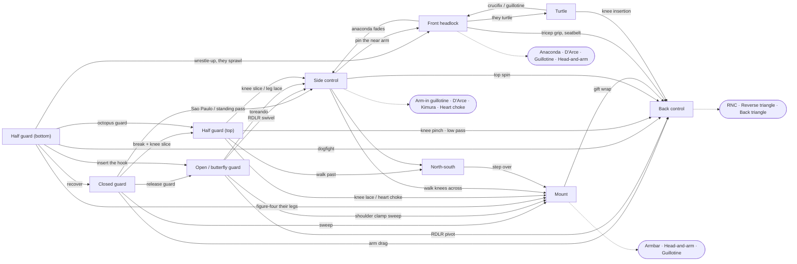

# Position-to-Position Map

"I'm in position X — where can I go from here?"

## The map

Major positions and the main routes between them. Solid arrows are the top player advancing or the bottom player sweeping; dashed arrows are submission systems that hang off a position.

Escapes run the other way — side control and mount bottom recover to guard or half guard; bottom turtle recovers guard or wrestles up. The tables below have the detail for every arrow, with links to the technique.

---

## From Closed Guard (Bottom) → [closed-guard](positions/02-closed-guard.md)

| Destination | How |
|-------------|-----|
| Mount | Scissor, pendulum, or hip bump sweep |
| Back control | Arm drag to back |
| Butterfly guard | Release guard, transition through high guard |
| Kimura | Hip bump defense → they post → kimura grip |
| Guillotine | Hip bump defense → they drive forward |
| Triangle | Isolate arm, throw legs up |
| Omoplata | Shrimp out, leg over shoulder |
| Armbar | Drag arm across, pivot perpendicular |
| Americana | Arm drag won't come across → clamp sweep → key lock on top |

## From Closed Guard (Top — Passing) → [closed-guard](positions/02-closed-guard.md)

| Destination | How |
|-------------|-----|
| Half guard top | Break guard, wedge knee, push down knee, slip through — begin the knee slice |
| Side control | Sao Paulo pass, standing pass, or cradle pass |

## From Half Guard (Bottom) → [half-guard-bottom](positions/03-half-guard-bottom.md)

| Destination | How |
|-------------|-----|
| Front headlock | Wrestle-up → they sprawl |
| Front headlock | Two-on-one wrist control → whizzer |
| Dogfight | Underhook → single leg → technical lift |
| Back control | Knee shield counter → underhook → shrug; or butterfly hook elevate → hip switch, or figure-four their legs |
| Closed guard | Frames + double hip escape → slide knee in |
| Butterfly guard | Insert butterfly hook (surprise option) |
| Half guard top | Octopus guard leg-over flip, or the ankle-shelf roll |
| Quarter guard (top) | Butterfly hook kick-through when they reach back to clear it |
| Mount | Butterfly hook elevate → figure-four their legs → roll through |
| Kimura | Attack from neutral half guard |
| Armbar | Kimura trap → they keep posturing → pivot |
| Back control (via north-south bait) | Kimura trap → they go north-south → over-rotate |
| Arm lock | Shoulder clamp, turn, straighten arm |

## From Half Guard (Top) → [half-guard-top](positions/04-half-guard-top.md)

| Destination | How |
|-------------|-----|
| Side control | Knee slice, leg lace, or low pass |
| Mount | Knee lace, quarter guard progression, heart choke |
| Armbar | Knee slice arm lock transition (180° pivot) |
| Kimura | Flatten underhook, attack straightened arm |
| North-south | Advance past half guard, walk toward head |
| Back control | Knee pinch scramble; low pass with back exposure; seatbelt from north-south after the arm lock |
| Front headlock / anaconda | From north-south after the arm lock transition, sprawl and collapse their arms |
| Guillotine (feint) | Guillotine feint when they scrunch up → mount |

## From Side Control (Top) → [side-control](positions/06-side-control.md)

| Destination | How |
|-------------|-----|
| Mount | Walk knees across, heart choke transition |
| North-south | Reposition arms, sprawl to clear hip hand |
| Back control | Top spin (they shrimp → spin 180° → seatbelt) |
| Front headlock | Pin the near arm → front headlock system |
| Guillotine | They shrimp and reach for underhook |
| D'Arce | They shrimp → thread arm across neck |
| Kimura | Swim past brace, walk to north-south; or the carving system |
| Armbar | From north-south, step over into technical mount; or the carving system / hidden armlock |
| Heart choke | They push you across during the carving transition |
| North-south choke | Arm-out during the carving transition, or when they clasp their hands |

## From Side Control (Bottom) → [side-control](positions/06-side-control.md)

| Destination | How |
|-------------|-----|
| Closed / butterfly guard | Frame, bridge, double shrimp, slide knee in |
| Half guard | Frame, bridge, shrimp, retain half guard |
| Wrestle-up | Shrimp, pummel for underhook, get to knees |

## From Mount (Top) → [mount](positions/07-mount.md)

| Destination | How |
|-------------|-----|
| Back control | Gift wrap → technical mount → roll to back |
| Side control | Swing leg around (bail from escape attempt) |
| Knee-on-belly | Drop hips, staple leg, knee across belly |
| Armbar | Walk elbow up → S-mount → armbar |
| Head-and-arm choke | Walk elbow up → gable grip → figure-four |
| Guillotine | They shrimp for knee-elbow escape |
| Americana | Pry an arm down; or arrive via the shoulder clamp sweep with the arm splayed |
| Reverse triangle | Gift wrap → leg over shoulder |

## From Back Control → [back-control](positions/08-back-control.md)

| Destination | How |
|-------------|-----|
| Rear naked choke | Work choking arm under chin |
| Reverse triangle | Gift wrap → leg over shoulder → grip ankle |
| Back triangle | Technical seat → leg over shoulder → rock |
| Mount | Release hooks, step over (rare) |
| Technical mount / chair sit | Knee flush to their back, step over, rock back |

## From Front Headlock → [front-headlock](positions/09-front-headlock.md)

| Destination | How |
|-------------|-----|
| Anaconda | Drag arm across, grip bicep, roll through |
| D'Arce | Thread under armpit, across neck, figure-four |
| Guillotine | Provoke response, swim around shoulder |
| Head-and-arm choke | Arm dragged across → tricep + wrist grip, leg over the back |
| Back control | Grip tricep, walk to side, seatbelt, hook; or step-over → arm-in guillotine → they turn away → far shoulder, kick through |
| Peruvian necktie | Step over the head and they do not react |
| Arm-in guillotine | Step over the head, they push the leg off, drop to the back |
| Side control / north-south | If anaconda fails, grip tricep, get to knees |

## From Turtle (Top) → [turtle](positions/10-turtle.md)

| Destination | How |
|-------------|-----|
| Back control | Choke threat → knee insertion → kick through → hook |
| Crucifix | Trap arm with legs after knee insertion |
| Guillotine | They reach around your hips |
| Back control (after they roll) | Isolate the far arm → they roll → post, seatbelt, technical seat |

## From Turtle (Bottom) → [turtle](positions/10-turtle.md)

| Destination | How |
|-------------|-----|
| Guard recovery | Bait single leg → they sprawl → circle out |
| Wrestle-up | Reach outside arm around their far leg |

## From Open Guards → [open-guards](positions/05-open-guards.md)

| Destination | How |
|-------------|-----|
| Mount | Shoulder clamp sweep (butterfly guard) |
| Side control | Reverse de la Riva swivel takedown → pass |
| Back control | Reverse de la Riva → pivot to back |
| Ankle lock | X-guard sweep → maintain grip → ankle lock |
| Ankle lock | Single leg X hip shrug takedown |
| Saddle | Step between legs, pivot 90°, fall back |
| Americana | Shoulder clamp sweep → mount → splayed arm |
| Single leg X | From butterfly: threaten the ankle pick, shoot the leg under |
| De la Riva | Release the RDLR hook, swivel |
| Half guard top (knee slice position) | RDLR traditional sweep, follow the ankle up |
| Arm lock | Shoulder clamp, they shift weight |

## From Open Guards (Top — Passing) → [open-guards](positions/05-open-guards.md)

| Destination | How |
|-------------|-----|
| Side control | Toreando, over-under, or double-under |
| Half guard top | Toreando to knee slice |
| Half guard top | Butterfly pass — push a hook down, splay the hip; or give the underhook |
| Back control | RDLR counter — pass to the back |
| Estima lock / toe hold / ankle lock from the hip | Their foot on your hip (see 5.4) |

---

## Reading This Map

Each row represents a transition you can make from a given position. The link tells you where to find the full details.

In a live roll, you will not plan three moves ahead. But understanding which positions connect to which — knowing that side control leads to the back via the top spin, or that the turtle leads to back control via the knee insertion — gives you a map of the territory. When your opponent moves, you know which direction to go.
