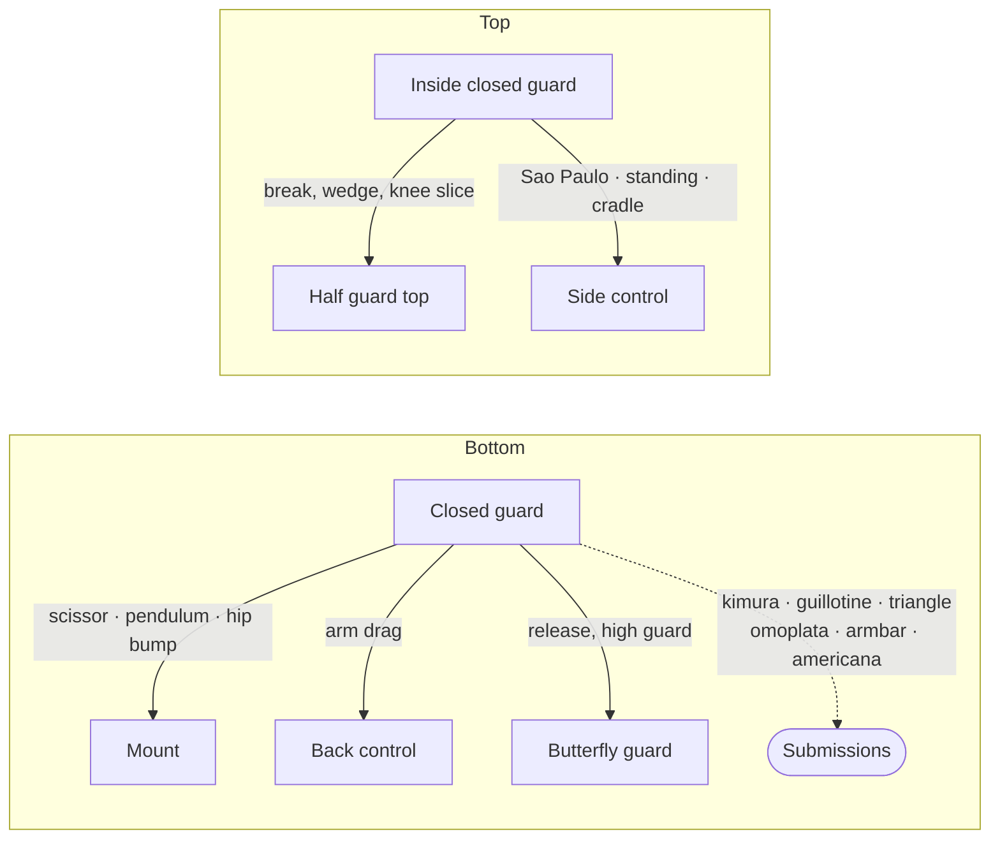

# Closed Guard — Your First Complete Position

The closed guard is where most beginners spend their earliest time in jiu-jitsu, and for good reason. It is the most intuitive position on the bottom: your opponent is between your legs, your ankles are locked behind their back, and you have a surprising amount of control despite being on your back. From closed guard you can sweep, submit, transition to other guards, and threaten enough attacks that your opponent is forced to respect you.

This page covers both sides: playing closed guard from the bottom and passing closed guard from the top. If you are in someone's closed guard, your job is to break the lock, get past their legs, and advance to a dominant position. If you have someone in your closed guard, your job is to control their posture, attack with sweeps and submissions, and make them pay for every mistake.

Unless a section says otherwise, descriptions attack your opponent's right arm and sweep toward your left.

---

## From Here

Where this position leads. Details for every arrow are in the sections below and in the [position map](../position-map.md).

---

## 2.1 Playing Closed Guard: The Bottom Game

### Controlling Posture

Everything from bottom closed guard starts with controlling your opponent's posture. If they are sitting upright with their back straight, they can brace against you, grip fight, and work to break your guard. If their head is pulled down to your chest with their posture broken, they are vulnerable to nearly everything in this page.

The most effective posture control begins with a gable grip behind their neck. A subtle but important detail: do not clasp your hands directly behind their neck, where they can simply posture up and break the grip. Instead, place your wrist behind their neck and clasp your hands off to one side. When they try to posture, the force drives into the bone of your wrist rather than through your fingers, making it far harder to break.

Once their posture is broken, you can begin attacking.

### Breaking Down Their Arms

When your opponent is in your closed guard, they will typically brace their hands against your chest or hips to keep distance and prevent you from attacking. Before you can threaten sweeps or submissions, you often need to clear those arms.

The basic method: swim your hands inside of their arms and push outward. This forces their hands to post on the mat beside your shoulders, brings their chest closer to yours, and opens up your attacks. From here you can control their head with one hand and begin isolating an arm with the other.

### Countering the Sao Paulo Pass (from the Bottom)

If your opponent is running the Sao Paulo pass on you, the most important defense happens *before* the pass progresses. Once they have flattened your hip to the mat and established pressure, it is very difficult to stop.

The key: do not accept getting your hip flattened. Keep your knees up in the air. If their head is driving to one side (say your right) as they attempt the pass, use a gable grip to drag their head back across your body to the other side. They may then attempt the pass on the other side, and you drag their head back again. It becomes a war of attrition, but at least both sides have counters — and you are not giving them the flat hip they need to complete the pass.

---

## 2.2 Sweeps from Closed Guard

A sweep reverses the position — you go from bottom to top. Sweeps from closed guard are among the most fundamental techniques in jiu-jitsu.

### The Scissor Sweep

The scissor sweep works when your opponent is leaning forward into you.

From closed guard, break their posture and establish a grip: your left hand controls their right elbow, and your right hand grips the back of their neck. Create tension by pulling them toward you. Then release your closed guard and shrimp slightly to one side, sliding your right knee across their chest as a shield between your bodies. Your left leg drops low, hooking against the outside of their right leg near the knee.

The sweep itself is a scissors action: kick your top leg (the knee shield) up and across while sweeping your bottom leg back. Combined with the pull on their elbow and neck, this tips them over their trapped leg and you come up into [mount](07-mount.md#74-arriving-at-mount).

The scissor sweep teaches a principle that applies to many techniques: the combination of a high force and a low force in opposite directions creates the off-balancing that makes sweeps work.

### The Pendulum Sweep

The pendulum sweep is a powerful option that starts with an arm drag — a technique worth understanding on its own.

Begin by controlling your opponent's right wrist with your right hand and gripping above their elbow with your left hand. Instead of dragging their arm all the way across your body (which would set up a back take), drag it about halfway so their forearm is tucked against your waist, trapped between your body and theirs.

Now reach your left arm over to their far armpit, dig your fingers in, and shift your body so you are resting on your right hip with your left hip angled toward the ceiling. This creates a barrier with your torso that prevents them from pulling their trapped arm free.

Release your closed guard. Hook under their far leg (left leg, in this case) with your right arm, getting your elbow as deep under the crook of their knee as you can. Now execute the sweep: punch upward with the arm hooking their leg, pull with the arm gripping their armpit, and swing your free leg in a wide pendulum arc to generate momentum. Your other leg kicks up and through. The combined forces sweep them onto their back, and you come up into mount with their arm still trapped — immediately ready to attack.

### The Hip Bump Sweep

The hip bump sweep exploits an opponent who is sitting upright and pushing down on your chest. It also introduces one of the most important chains in closed guard: the hip bump to kimura to guillotine sequence.

There are two moments to hit it: when they are bracing on your chest or lower ribcage to posture up, and when they are simply sitting upright. In both cases you have first been pulling them in with your legs — ankles clasped, pulling their body down into you — so that their posture is already under attack.

Start by swimming your hands inside their arms to clear their posts. If they are bracing on your chest, swim your forearms under theirs and up, and their arms fall off to either side of you — they pitch forward because you took the brace away. As their hands go to the mat beside you, immediately post on one hand (say your left hand) and sit up explosively toward the same side. Reach across with your right arm, over their right shoulder, and clamp down on the back of their right arm at the tricep. Your left shin goes flat to the mat beside their right knee and shin. Kick up with your right leg, driving your right hip up and across their body, trying to tip them over to your left. If it works, your right leg keeps traveling until it has swung 180 degrees and your knee lands on the mat: you are in mount.

Against anyone with experience, it will rarely work outright. That is not the point. The sweep creates the reaction, and the reaction is what you attack.

**If the sweep works:** You end up in mount. Excellent.

**If they post their arm to stop the sweep:** They brace out wider with their right arm, and the wider the brace, the more exposed the arm. You already have the back of their tricep with your right arm. Grab their right wrist with your left hand, reach through behind their right arm with your right hand, and grip your own left wrist: a kimura grip. Now sink back — but *off* their center line, to your left, so your body is as close to perpendicular to theirs as you can get. That angle is what makes the finish strong. As you lie back, clamp your right elbow down hard onto their right shoulder joint and keep it squeezed in; then crank, bringing their thumb up behind their back as if to touch it to the back of their head. Keep them from escaping with your legs — closed guard, or your left leg swung over their back and your right leg trapping their left leg. (Finishing details in [Submissions](../submissions.md#113-kimura).)

**If they drive forward to resist the sweep:** They are leaning into you with their head exposed. This also happens when you attack the kimura and they defend by wrapping their right arm around your waist and wrestling their head over to your right side — they have protected the arm but exposed the neck. As your hips come back down from the bump, swing them all the way under so you are sitting with your hips back and shoulders forward; now their push cannot topple you, and they have to push even harder. Release your left hand from their arm, bring your right arm around their head, and take the guillotine — arm-out if you can, arm-in if you must. Fall toward the side their head is on (see [Front Headlock](09-front-headlock.md#the-hip-bump-to-guillotine) for finishing details).

**The head-wrap variation → triangle.** Hip-bump-adjacent rather than a hip bump proper. Instead of reaching your right arm across to their right arm, act as if you have made a mistake: keep your right arm on your own right side and wrap it around the left side of their head, moving their head toward their right. Everything else is the normal hip bump. It provokes the same reaction — they plant their right hand out wide to keep from being toppled — but now your left leg is free to swing around that posted arm and over their right shoulder, across the back of their neck. Bring your right leg up, cross your ankles, grab your left shin with your right hand (it never left that side), and pull down to break their posture into the triangle — the mirror image of the one described in [The Triangle](#the-triangle) below.

This is the action-reaction principle at work. The sweep, the kimura, the guillotine, and the triangle are not four separate techniques — they are one chain ([chains/04-closed-guard-attack.md](../chains/04-closed-guard-attack.md)). You present a dilemma: any direction your opponent moves gives you something to attack.

### The Arm Trap Sweep

A simpler option that punishes a common mistake. When you have your opponent in closed guard with broken posture — say your left arm has an underhook and your right arm controls their neck — less experienced opponents will sometimes try to snake their arm between your bodies to brace against your neck and create distance.

This puts their arm in a weak position: it is across their body with limited leverage, and their elbow is exposed near your neck. Push their elbow across with your left hand and re-grip so that you are essentially in a head-and-arm triangle position from closed guard. From here you can use the control to sweep.

### The Arm Drag to Back Control

The arm drag is not technically a sweep — it is a transition to back control — but it starts from the same closed guard entries. The principle is in [Foundations](01-foundations.md#17-the-two-on-one-and-the-arm-drag); this is the closed guard version.

**The two-on-one and the legs.** Take their right wrist with your left hand, then your right hand above it: a two-on-one. In closed guard you cannot break their posture with the grip alone — they are too close for you to extend the arm and pull — so you do what you should always do in closed guard: use your legs. Pull them into your body with your legs to collapse their chest onto yours. With their right shoulder trapped between your bodies, slide your right hand behind their right tricep, and reach your left hand into the crook of their armpit.

An alternative grip: grab their right wrist with your right hand and grip just above their elbow with your left hand — feeling for the bony prominences above the joint, which gives an extremely strong hold — bridge to pull their arm forward and break their base, then drag across to your right side as you release your guard. Either entry works; the two-on-one plus legs is the more reliable way to break posture.

**The drag and the back take.** Pull their tricep with your right hand and their wrist with your left so their arm crosses their center line. Transfer the grip: loop your right arm around their bicep, snug against your side so they cannot retract it. Loosen your legs, release the guard, come up onto your right hip, and reach your left arm all the way around their back to grip their far armpit. Keep your chest tight to their back. Sneak your left leg in as a hook between their thighs, establish a [seatbelt grip](08-back-control.md#82-the-seatbelt-grip) (one arm over the shoulder, one under the armpit), and rock down to your side to begin establishing full back control (see [Back Control](08-back-control.md#from-closed-guard-arm-drag)).

A more direct version: with their right elbow trapped against your stomach, keep pulling the arm across while opening your guard and sitting further onto your right hip. As they come across, their shoulder goes to the mat and you go straight to hooks.

### The Arm Drag to Pendulum Sweep

Once the arm is dragged across and they are pinned down on you, the [pendulum sweep](#the-pendulum-sweep) becomes much stronger, because the trapped arm cannot post. Go onto your right hip to block them from retracting their elbow, reach under their left thigh with your right arm, swing your left leg in a pendulum arc for momentum, and carry them over their right shoulder to your right. You come up in mount with the arm still trapped.

### The Arm Drag to Arm Lock

From the same pinned position you can move to the resting position before an arm lock: bring your left leg over their right shoulder and clasp your legs together. And the counter that always applies here: if they post with their left arm and posture up to free their right elbow and shoulder, take the quick arm lock — gable your hands around their right tricep, roll a full 180 from your right hip to your left, and bring your right arm across to trap their left wrist in the crook of your neck. It comes on fast. This is the same arm lock as [the sneaky armbar chain](#the-armbar-from-closed-guard) below, entered from the drag; the shoulder-clamp version is in [Open Guards](05-open-guards.md#the-shoulder-clamp-to-arm-lock).

### When the Drag Will Not Come Across: The Clamp Sweep

Against a strong opponent you may pull them down with the two-on-one and still be unable to drag the arm across their center line. Do not keep fighting for it. Instead, reach your left arm around to their left armpit and across their back, clamping them chest to chest (your legs have already pulled them in). Shift onto your right hip and wedge your stomach so they cannot pull their right arm back across. The arm is not dragged, but it is trapped just as well.

**Clamping the posting arm.** If they post with their left arm, reach up with your right arm and wrap it around their left arm from the shoulder, the crook of your right elbow against the back of their left shoulder. Clamp down and pinch their left arm between your head and your right arm, pulling it into the crook of your neck. It is very uncomfortable for them.

**The sweep.** With their right arm trapped against your stomach and their left arm clamped, release your legs. Keep your left arm behind their body, still clamped on the armpit — do not bring it over their face to attack the arm yet. Bring your right knee off their left hip and kick it down toward their left knee to clear it, then roll to your right and sweep them onto their left side.

**If they sit back to stop the sweep:** they drive their hips back hard while you are still clamped on them. That opens a pocket at their right hip. Insert your left butterfly hook there, push with the hook while your right leg pulls their left knee out, and finish the sweep.

**On top: the key lock.** As you roll through, go straight to their extended right arm: bring your left arm around from behind their shoulder, tuck your head against their right arm, and pull it away from their body. They will try to bring their left elbow down to their side so they can bridge and shrimp — but to do it they have to push their left arm against the right side of your head. Resist, then suddenly stop resisting: their arm pulls through into the key lock position. Your right arm is already under their left elbow; your left hand takes their left wrist, your right hand takes your own left wrist, and you attack the key lock ([americana](../submissions.md#114-americana)). If they straighten the arm to defend, lift your right elbow under their elbow while pushing their wrist away with your left hand — a straight arm lock.

The full decision tree is in [chains/09-arm-drag.md](../chains/09-arm-drag.md).

---

## 2.3 Submissions from Closed Guard

### The Triangle

The [triangle](../submissions.md#112-triangle) choke is one of the signature submissions in jiu-jitsu. It uses your legs to create a choking pressure around your opponent's neck and one of their arms, trapping them in a figure-four with your legs.

**The setup.** The first step is isolating one arm. If your opponent is in your closed guard, you need to control one wrist — say their left wrist — so that when you throw your legs up, that arm stays outside the triangle while their other arm and head are caught inside.

A common way to arrive here from broken posture: you have pulled them down with your legs high on their back, your right hand reaching into their left armpit and your left hand under their right arm, so they are wrapped in a hug. To bring your right leg over their left shoulder from here, the detail that matters is the hip: drop your left hip all the way to the mat and scoot, so that their left elbow is trapped against you *and* your right leg is free to come up over the shoulder. Half-dropping the hip leaves you stuck — close but unable to attack. And if they posture up out of this position, that is an armbar, not a lost triangle.

Open your closed guard, throw your right leg over their left shoulder, and bring your left leg under their right armpit. Hook the back of your left knee over the top of your right ankle, trapping their right arm and head in the triangle your legs are forming.

**Controlling posture.** You will rarely land a perfect triangle on the first attempt. Usually there is work to do. The immediate priority is not their arms — it is their head. Grab the top of their head with both hands and pull down while squeezing your legs in. They will be trying to posture up; you are trying to pull them deeper.

**Cutting the angle.** To tighten the triangle, turn your body toward the side of the leg that is over their neck. If your right leg is over the back of their neck, turn toward your right shoulder. This narrows the space their head and arm are trapped in.

You can use your bottom leg to help: briefly unclasp it from your top ankle, plant your foot on their hip, and push off to rotate your body even further at an angle. Then immediately re-clasp. This is the difference between a loose triangle that they can fight out of and a tight one that finishes.

**Finishing.** Once you have the angle and the squeeze, drag their trapped arm across their own face. This eliminates the space between their neck and shoulder and completes the choke. At this point, squeeze your knees together and extend your hips.

**The angle principle.** A useful rule of thumb: turn away from where the foot over their neck is pointing. If your right foot points to the left, roll toward your right shoulder. This alignment tightens the triangle maximally.

### The Triangle to Armbar Transition

If your triangle is locked up but not quite finishing — perhaps they are defending the choke by tucking their chin or stacking you — you can transition to an armbar on the trapped arm. The arm is already isolated between your legs. Adjust your hips, extend their arm, and apply the armbar. This keeps you attacking without giving up position (see [Submissions](../submissions.md) for armbar finishing mechanics).

### The Armbar from Closed Guard

**The basic armbar.** If your opponent makes the mistake of extending their arms against your neck from inside your closed guard — essentially trying to choke you with straight arms — the armbar is straightforward. Control their right wrist with your left hand, hook your right arm under their left thigh, and use that to pivot your body perpendicular to theirs. Your right leg rides up under their left armpit. Release your guard, bring your left leg over their head so it sits between their shoulder and neck, pinch your knees together, and bridge your hips up to hyperextend the elbow.

**The more realistic armbar.** Against a competent opponent, no one extends their arms like that. Instead, you need to work for it. Pull their posture down by gripping behind their right tricep with your right arm (reaching across your body) and pulling their arm across the center line. Simultaneously, pull down on their left shoulder with your left arm to break their posture. With their right arm dragged across and their posture collapsed, release your guard, push off their hip with your left foot to swing your body perpendicular, and ride your right leg up under their armpit. You can pause in the "pit stop" position — legs linked, their arm controlled — before bringing your left leg over their face and finishing.

**The sneaky armbar chain.** This is a higher-percentage option that uses the arm drag to set up the armbar indirectly. From closed guard, execute an arm drag on their right arm: grip their wrist and above the elbow, drag their arm across your body, and shrimp onto your right side to trap their elbow between your chest and their body.

Your opponent's natural reaction is to post their free (left) hand on the mat to avoid being swept. That posted arm is now exposed. Release the grip on their right wrist, reach up with your right arm and pull it over their left shoulder, gable grip with both hands, and turn to your left side. This straightens their left arm across your shoulder — and that is the arm lock. It comes on fast and can also be used to sweep to top position if it does not finish immediately.

The deeper principle: any time you threaten one side, your opponent posts on the other side. That post is an opportunity.

### The Omoplata

The [omoplata](../submissions.md#115-omoplata) is a shoulder lock applied with your legs — essentially a kimura performed with your lower body instead of your arms. It is not a high-percentage finish on its own, but it creates excellent opportunities for sweeps and transitions to dominant positions.

**Setup.** Break your opponent's posture and gain tricep control on one arm. Say you grip the back of their right tricep with your left hand, keeping your elbow inside their arm for control. Pull their head down with your right hand.

Open your guard and shrimp out to your left side. As your back rises into the shrimp, it clears their right arm from its posting position — they lose that base. Now bring your left leg around their back and over their right shoulder, draping your ankle into the crook of their neck. Bring your right leg up to meet your left foot, pinching them together for control.

**Finishing.** Straighten your left leg to drive their right shoulder toward the mat. Transition into a seated position: your legs form an S-shape, your hips come up, and you reach for their far shoulder. Their trapped arm is pinned between your hip and ribcage — you are not using your arms to hold it, which leaves your hands free. The finishing pressure comes from your hip driving forward while their shoulder is pinned.

**The hip control detail.** If your opponent is on their knees with their hips off the mat, they have wiggle room to escape. It is much better if they are completely flattened out. To achieve this: scoot your hips away from theirs to create space, then use your far arm to drag their far hip toward you. This tips them so their near hip falls against the mat and they are flattened. Now finish as normal — you have far more leverage with them flat.

If they roll to escape the omoplata, follow the roll — you will often end up in side control on top, which is an excellent outcome from what started as a bottom guard attack.

**From a triangle defense.** If you have a triangle locked up and your opponent begins to escape by pushing their trapped arm down and around your leg, you can release the triangle and transition directly to an omoplata on that arm.

### The Kimura Trap

The kimura from closed guard is covered in detail in the hip bump sweep chain above and in [the kimura trap system](../submissions.md#the-kimura-trap-system) ([chains/08-kimura-trap.md](../chains/08-kimura-trap.md)). The key point for this page: the kimura is most often entered from closed guard as a reaction to your opponent posting their arm to defend a sweep. The hip bump to kimura connection is the most common entry.

---

## 2.4 High Guard

When your opponent is in your closed guard and playing very tight — head down on your chest, arms clamped to your hips to prevent you from working your legs to either side — the high guard is a way to create attacks.

Start with a gable grip behind their neck, clasped to one side, pulling their posture down. Then open your guard and shrimp out to one side, sliding your far leg into the space between their arm and leg. Ideally, you get a butterfly hook under their thigh; if not, your foot on their hip works too. Your near leg comes up behind their back and clamps down.

This position does several things: it traps their torso between your legs, weakens one of their shoulders by opening it up, and frees your hands. From here you can threaten the omoplata, and when they try to posture up to escape the discomfort, you can eggbeater your top leg around their arm and over their shoulder to begin setting up a triangle.

### The Shoulder Clamp from Closed Guard

A related position: if you can clamp your opponent's shoulder in a gable grip from closed guard — say their left shoulder between your two arms, with your left elbow under their chin creating tension — you have several options. You can attempt a quick arm lock on the clamped arm. More importantly, you can release your closed guard, transition through high guard into butterfly guard, and use your butterfly hook to sweep them directly into mount. The shoulder clamp system is covered in more detail in [The Shoulder Clamp System](05-open-guards.md#52-the-shoulder-clamp-system) and [chains/07-shoulder-clamp.md](../chains/07-shoulder-clamp.md).

---

## 2.5 Passing Closed Guard

When you are inside your opponent's closed guard, your goal is to break their ankle lock, get past their legs, and advance to a dominant position. Closed guard passing is built on a general principle: create tension on the lock their ankles form, then use that tension to pry their guard open. In every case, you are giving up something to gain something — there is no free guard pass.

### The Wedge Pass

A fundamental low pass. Brace both arms against your opponent's ribcage (not their hips — if you brace on the hips, they can pull your elbows forward and collapse your posture). Bring one knee — say your right — under their tailbone as a wedge by posturing up slightly. Then sit back, and the wedge creates pressure on their ankle lock.

With their guard under tension, reach back with your left arm and push down on their right knee to pry the guard open. Keep your right arm braced against their left inner thigh and hip to prevent them from sitting up and taking your back — do not reach back with both arms at the same time.

### The Sao Paulo Pass

The Sao Paulo pass is a low pass — you do not stand up — and it is one of the safest options from inside closed guard. There are two versions: with the arm trap and without.

**With the arm trap (the safer version).** Start by isolating their right arm. A useful setup: reach up with your left hand and pin their right wrist to the mat, pushing it upward. They will reflexively pull their arm down. As they pull, release the grip, turn your hand over, and redirect their arm down toward their hip. In the same motion, get on your toes and raise your hips, which lifts their hips off the mat. Snake your right arm under their lower back and pass their right wrist from your left hand to your right hand behind their back.

Now bring your head down against the mat on their right side, trapping their right elbow with your forehead and driving your shoulder into their stomach. Keep your right elbow tight against their hip and your grip strong on their wrist. This prevents the hip escape.

Drop to the S-position with your legs: right hip to the mat, legs scissored. Use your left elbow — kept tight to your body, not extended — to push down on their right inner thigh and pry the guard open. If that is not enough, straighten your left leg to create pressure under their calf.

**Critical safety detail:** Do not reach back with your left arm extended, palm pushing on their thigh. This exposes your arm to a kimura — if they free their right hand, your extended left arm is perfectly positioned for them to attack. Instead, keep your left arm tight against your side and use your elbow, not your hand, to push.

As soon as their guard opens, step your left leg over to staple their right thigh with your shin, then transition your head up to establish head control and begin passing to side control.

**Without the arm trap.** Same mechanics, but you skip isolating their arm. This is faster but riskier — their free arm can threaten omoplata and triangle. Compensate by keeping your right arm clamped hard against their left hip to prevent the hip escape.

### Standing Passes

Standing passes are especially effective under rulesets or at levels where leg locks are rare or not allowed (typically white and blue belt). Several variations exist; most share the same opening: control their biceps by pinning them to the mat, then stand up.

**The push-leg pass.** Pin their biceps, step up to both feet, and posture up. Release the bicep grips and step back with your left foot while pushing down on their right inner thigh with both hands. Their right leg slides off your left leg as you step back, and you can begin working past their now-open guard.

**The cradle pass (often the highest-percentage of the three).** Pin their biceps and stand up. Step back with your left foot, but instead of pushing down immediately, reach across with your right arm and cup the outside of their right leg to keep it elevated. Reach back between their legs with your left arm and sweep it across your body to break the ankle lock. Transfer their right leg so it is cupped between your neck and right shoulder, then drop to your knees. You land in a cradle grip with powerful control, and from here it is a short path to side control.

**The arm-across pass.** Grip fight until you get control of their right elbow. Drive it across their body past their center line. Step up with your left leg (the safe leg — they cannot reach it with the arm you have controlled). Step back with your right leg, pull up on their wrist and elbow to straighten their arm, and push back on their leg with your free hand. The guard opens with little resistance.

### Closed Guard to Knee Slice

Once you have broken the closed guard using any of the methods above, you often end up in a position to begin a knee slice. Open the guard with the [wedge pass](#the-wedge-pass), then slip your right knee between their legs and onto their right inner thigh.

From here, the knee slice technique takes over — bring your left leg over their right foot, establish an underhook with your right arm under their left arm, and slice your right leg all the way through before swiveling your hips to consolidate side control. The full knee slice is covered in detail in [The Knee Slice](04-half-guard-top.md#42-the-knee-slice).

**An important safety note:** do not swivel your hips toward side control until your right leg is completely free — see [the safety rule](04-half-guard-top.md#the-safety-rule).

The full decision tree is in [chains/01-knee-slice.md](../chains/01-knee-slice.md).

---

## Summary

Closed guard is the first complete position most people learn, and it remains relevant at every level. From the bottom, control posture, threaten sweeps, and chain your attacks so that every reaction your opponent makes opens a new opportunity. From the top, work to break the guard safely, protect your arms, and transition to your passing game.

The techniques in this page connect directly to what follows. The knee slice entry from closed guard leads to [Half Guard Top](04-half-guard-top.md). The arm drag to back control leads to [Back Control](08-back-control.md). The hip bump to kimura to guillotine chain appears again in [Front Headlock](09-front-headlock.md) and [Submissions](../submissions.md). Closed guard is not a dead-end position — it is a launchpad.
