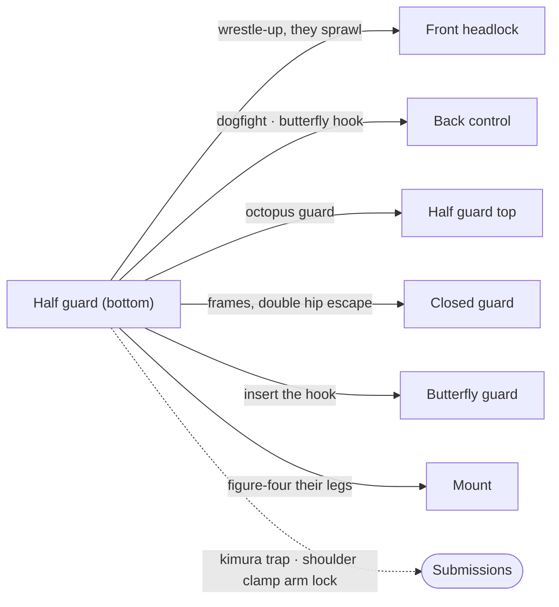

# Half Guard — The Bottom Game

Half guard gets more space in this reference than any other position, for good reason: it is the position where the most nuanced battles take place and where a practitioner's understanding of jiu-jitsu is most thoroughly tested. If closed guard is your first language, half guard is where you become fluent.

Half guard is a neutral position. Both the top player and the bottom player have meaningful options. As the bottom player, you can sweep, wrestle up to your feet, attack submissions, recover full guard, or transition to back control. None of these outcomes are given to you — you have to earn each one through a combination of framing, timing, and the relentless fight for the underhook.

This page covers the bottom game: how to survive, how to defend, and how to turn half guard into an attacking position. [Half Guard Top](04-half-guard-top.md) covers the top game — how to pass half guard, including the knee slice system.

All descriptions assume your opponent's right leg is trapped in your half guard and you are on your right side.

---

## From Here

Where this position leads. Details for every arrow are in the sections below and in the [position map](../position-map.md).

---

## 3.1 The Position

In bottom half guard, you are on your back or your side with one of your opponent's legs trapped between yours. Your opponent is on top, trying to free their leg and advance to side control or mount. You are trying to either improve your position or attack.

The neutral starting point: you are on your right side, your opponent's right leg is caught between your legs, and you have your braces in place — left forearm against their neck, right forearm ready to block their hip. They are pushing into you, trying to flatten you out and establish control.

From this neutral position, everything branches. The [underhook battle](#34-the-underhook-battle), the [knee shield](#33-the-knee-shield), the [wrestle-up](#35-the-wrestle-up), the [kimura trap](#the-kimura-trap-system), the [shoulder clamp](#the-shoulder-clamp-to-arm-lock) — they all start here.

---

## 3.2 Framing and Survival

Before you can attack, you need to not get passed. The fundamental survival tools in bottom half guard are the same frames introduced in [Foundations](01-foundations.md#14-framing-and-bracing), applied specifically to this position.

### The Two Braces

Your left forearm braces against their neck. Your right forearm is ready to brace against their hip when they try to advance. In both cases, frame with the bone of your forearm, not your hand — if you brace against their hip with an extended palm, they can drop their weight and injure your wrist. You should be able to wave your hand freely.

### Bridge Before You Brace

The most common mistake: trying to push your opponent off you with your arms while your hips stay flat. This is a bench press against their body weight and gravity. You will lose.

Instead: bridge first. Drive your hips up explosively to lift their weight off you. *Then* extend your frames to maintain the space while you hip escape. Your legs create the space; your arms hold it.

### The Double Hip Escape

When escaping from a bad position in half guard, do not try to recover guard on the first shrimp. Bridge, brace, and shrimp once to create initial space. Then push off your foot and shrimp a second time. Two hip escapes in sequence creates enough room to either slide your knee in for guard recovery or pummel for the underhook.

### When They Sit to Their Hip

If your opponent sits up to their hip instead of staying chest-to-chest, your standard frames become weak — the angles are wrong and you risk overextending your arms. Recognize this shift and adapt: bring your far arm down to hug your ribcage (protecting the underhook path), and drop your near elbow to the mat as a block. Shrimp away from them — their hips cannot follow past your elbow on the mat.

---

## 3.3 The Knee Shield

The knee shield is your primary tool for creating distance and preventing your opponent from closing in to pass. You raise your left knee across their stomach or hip, creating a frame with your shin that keeps their chest away from yours.

There are two types:

**The low knee shield** is the most common. Your left shin crosses their stomach, resting against their hip bone. From here you can push them away, create space to work, and threaten sweeps. This is the position you will use most often.

**The high knee shield** places your left knee higher — between their neck and shoulder, against their upper chest. This is less common but creates strong frames. From the high knee shield, you can work to replace the knee with an underhook, or use it as a platform to wrestle up.

### Using the Knee Shield Actively

The knee shield is not just a wall — it is a tool you use to set up your next move. The most important transition: when your opponent pushes on your left knee to clear the shield, let your left arm travel with the knee. As the knee goes back and under their armpit, your left arm follows through to achieve an underhook on their right arm.

The details: place your left hand on your own left knee and your right hand on their left bicep. When they push your knee to clear the shield, allow your left arm to travel with the knee and under their armpit, then swing it up into the underhook. Scoot your hips toward their hips and legs. Shrug your underhooking arm to free your head from under their arm, and begin working toward back control.

If they respond with an overhook to neutralize your underhook, use your legs: hook your left ankle over their right ankle, pull it toward your left side to turn their hips and straighten their leg, and begin reaching down to grab the leg for a wrestle-up.

### Getting the Knee Shield Back

If your opponent has beaten your knee shield and is starting to advance, the priority is getting it back in. But if they have progressed too far for that, you have a backup option: establish a two-on-one grip on their wrist. Cross your arms so that your left hand grabs as close to the end of their left wrist as possible, keeping it on the mat, while your right hand grips their forearm.

Post your right arm out above your head on the mat — not behind your back, which feels more natural but allows them to reach around and grab your forearm. Keeping it above your head keeps it out of their reach.

From here, start getting to your knees. When you have sat up enough, release the wrist control, swing your left arm around their head, and whizzer their arm. Jump your knees to the outside so you are on your left knee and shin, creating pressure between your body and the whizzer. From this position, you can transition into a front headlock — which connects to the entire anaconda and guillotine system covered in [Front Headlock](09-front-headlock.md).

---

## 3.4 The Underhook Battle

The [underhook](01-foundations.md#12-the-underhook) is the most important positional battle in half guard (the top player's side is in [Half Guard Top](04-half-guard-top.md#the-underhook-battle-from-top)). Whoever wins it has a decisive advantage.

From bottom half guard, you are trying to get your left arm under their right arm, with your hand ending up near their hip — not high on their back or shoulder. A high underhook is weak; your opponent can turn it into a whizzer and neutralize it. A low underhook, tight to the body, with your hand near their hip — that is the underhook that lets you wrestle up.

### Use Your Legs to Create the Underhook

This is one of the most important insights in this page and one that many beginners miss entirely.

The instinct is to reach for the underhook with your arm. But if your opponent has you flattened out with their weight across your center line, reaching with your arm produces a weak, extended underhook that they can attack — collapsing on it, threatening kimuras, or simply pinning it flat.

Instead, use your legs to move their body into a position where the underhook becomes easy. Drive your knees up explosively — your left knee comes into their right side, pushing their body up toward your upper body. As they are pushed up and their weight shifts, *then* slide your arm through for the underhook and start wrestling up.

Your legs create the space. Your arm fills it.

### Recovering the Underhook

If your opponent has established the underhook and head control and is starting to flatten you out, you need to recover. There are several methods:

**The bridge and circle.** Place your right hand on their elbow. Bridge, trying to bring your left shoulder up and over their body. If they do not react, you would sweep them — but a good opponent will give a little space to accommodate the bridge. When they give that space, continue to bridge and push your left elbow through toward their head, making it uncomfortable enough that they move. Then immediately tuck your left elbow into your chest and *keep circling* it down until you reach the underhook at their hip.

The critical detail: do not stop with your arm between your chest and theirs. If you just clear space and park your arm there, they will drop their weight and pin it. You must keep circling until you reach the underhook. And do not swing your arm wide and high around their head — push their head slightly to create a small gap, tuck the elbow, and circle tight.

**The timing underhook.** Sometimes you can use your opponent's own passing attempt to create the underhook opportunity. If they are trying to flatten you out and you feel the moment of transition — as they roll you from your side to your back — there is a brief window where you can punch your left elbow through and swing up for the underhook. But the window is small. As soon as you establish the beginning of the underhook, you must immediately bridge back the way you came, bringing your shoulder up off the ground, and push your knees up to bring their body closer. Then punch the underhook into position. If you let them settle with you flattened out, the underhook dies.

**Baiting head control.** A more advanced setup: act like you are going for a leg attack. Hook your right hand under their left thigh and start bringing your left arm across your body as if linking up for a leg lock. Many opponents will respond by going for head control — grabbing under your right arm and over the left side of your neck with a gable grip.

If you anticipate this, keep your left elbow just past your chest so it does not get trapped as they flatten you. As they commit to the head control and roll you, that pocket of space lets you pull your elbow through and swing it up for a quick underhook. At the same time, use your knees to push their body up. Then bring the underhook down to wrap around their right leg and transition to the wrestle-up.

---

## 3.5 The Wrestle-Up

The wrestle-up is what you do once you have the underhook. It is the primary offensive path from bottom half guard — and it connects directly to the front headlock system that is covered in [Front Headlock](09-front-headlock.md#91-the-front-headlock-position).

Once you have the underhook low on their hip, bring your arms down to get a single leg on their right leg. Technical lift: get to all fours with their leg trapped between your arms and between your legs. This position is called the **dogfight** in wrestling.

### Dogfight Options

From the dogfight — both of you on all fours with their right leg trapped — you have several options, depending on how they react:

**They turn their upper body away from you.** This exposes their far ankle (left ankle). Reach with your left arm, grab it, and pull their base out from under them. This is the strongest option because they have very little leverage to resist.

**They turn toward you.** This exposes their left knee. Reach across with your right arm, grip the knee, and drive through — but aim to push their butt toward the ground where they have no base, not straight across into their base. Use your head and shoulder to drive.

**They stay neutral and do not post on your head.** Explode up, get a body lock on their back, and transition to [back control](08-back-control.md) or [front headlock](09-front-headlock.md). This can also be used as a reaction: if you reach for their ankle and they explosively extend that leg away from you, they now have less ability to escape when you go for the body lock.

### The Full Wrestle-Up Sequence

From the underhook, wrap around their right leg with both arms. Take your top leg (left leg) and use it to trap and turn their right leg, rotating it perpendicular to their center line. This forces them to start turning. Throw your left shoulder into their right hip to lighten the load on their trapped leg, then do a technical stand-up — bring your right leg under and through to get to the dogfight position.

If they post on your head to try to pry free, clear your right leg and bring it around their leg so it sits in the pocket of your right hip on the outside. This turns their leg in a way that forces them to their side — they cannot resist because continuing to fight would torque their own knee.

The decision tree is drawn in [chains/02-half-guard-wrestle-up.md](../chains/02-half-guard-wrestle-up.md).

---

## 3.6 Attacks from Bottom Half Guard

### The Kimura Trap System

The kimura is always available from bottom half guard when your opponent presents their arm. The kimura trap system ([chains/08-kimura-trap.md](../chains/08-kimura-trap.md)) is the series of measures and countermeasures that follow once you have the grip.

**The basic kimura.** Your opponent presents their left arm. You grab it in a kimura grip — your right hand on their wrist, your left hand gripping your own right wrist, forming a figure-four on their arm. Your goal: free their arm from where they are gripping their own leg and pull it behind their back while flattening your own back to increase your leverage.

**When they clasp their hands and posture up.** This is their primary defense — grabbing their own left hand with their right and posturing up. If you let them continue, they can reverse the kimura on you. The counter: release your half guard, take your left leg, and drape it over their head and across the shoulder of the trapped arm. Hook your left heel toward their inner chest. Now push down with your leg and pull up with the kimura grip — this creates enormous leverage.

**When they continue to posture despite the leg.** Accept the posture, keep the leg draped, free your right leg from between theirs, and use your head and shoulder as a pivot. Pivot from your right side to your left side, bringing your right leg across their face, and extend into an [armbar](../submissions.md#111-armbar). This is powerful but requires good timing and can stress your neck.

**The north-south escape and counter.** If your opponent frees their legs and tries to escape the kimura by going to north-south position, you can bait this. Let them go. As they transition, rotate underneath them so you clear out on their right side, pushing their trapped left arm toward their right hip. Use this to over-rotate them onto their back. From there, control them with your right arm pressing down on the left side of their chest, and work to finish the kimura or transition to back control (see [the kimura trap system in Submissions](../submissions.md#the-kimura-trap-system) for the full finishing sequence).

### The Shoulder Clamp to Arm Lock

From bottom half guard, you can attack the shoulder clamp — clamping their left shoulder in a gable grip. The key detail that makes this work: instead of just clamping and stalling, do everything in one motion. As you go to clamp their left shoulder, turn onto your left hip, bring your right knee up through their legs to block their left knee from coming up, and turn so their left wrist sits in the crook of your neck and right shoulder. This straightens their arm into an arm lock that comes on fast.

The danger: whenever you reach across your body like this, your opponent can bring their weight down and smash your left shoulder. Be aware of this risk, but the speed of the technique can mitigate it. The shoulder clamp system is covered in more detail in [Open Guards](05-open-guards.md#52-the-shoulder-clamp-system) and drawn in [chains/07-shoulder-clamp.md](../chains/07-shoulder-clamp.md).

### Threatening the Leg

You can threaten your opponent's far leg by reaching down to gable grip under their left thigh to unbalance them. But the positioning of your arm is critical.

**Keep your left elbow tucked close to your hip.** If you extend your arms to reach for their leg, they can collapse their weight and trap your arm against your body. Worse, they can attack [heart chokes](../submissions.md#1110-heart-choke) by pinning your left shoulder under your chin. If your elbow is tucked near your hip bone, even if they flatten you out, you retain a pocket of space to bring your elbow through and establish the underhook.

**Use the unbalance, not your arms.** If you do get the gable grip on their leg, do not try to pull the leg up with arm strength — your arms against their leg and sprawl will lose. Instead, clamp their trapped (right) knee tight between your knees, turn onto your left hip, and bring their center line across yours. This unbalances them and brings the leg up to you naturally.

### The Butterfly Hook Surprise

If your opponent has you flattened out with head control and you cannot recover the underhook, an unexpected option: work your left leg into a butterfly hook under their right hip. Snake it in — it may start weak, but even a shallow hook creates opportunities. When they press into you or try to advance to side control, the butterfly hook lets you elevate and sweep. This is deeply counterintuitive — the top player believes they have achieved everything they need to pass, but they have played directly into the hook.

**Once the hook is in.** Say you have their right leg in half guard, your left butterfly hook under their right hip, and you have swum under their left arm — but they have sat to their left hip to keep you flat, so you are not up in the [octopus guard](#the-octopus-guard) yet. If you can post on their back and keep them low on your body, three things are available, chosen by how they deal with the hook.

- **They reach back to clear the hook.** Simplest case. Grab that arm and kick through with the hook. You come up on top in quarter guard.
- **They put their center line over the hook.** They think they are smothering it; this is what you want from a butterfly hook. Elevate them. As they come up, kick your right leg through, switch your hips underneath their body, and turn them in the air, so that when they come back down you have their back.
- **They will not let you switch your hips.** Fine. While they are elevated, release the hook and quickly figure-four your legs around both of theirs, squeezing their legs together. With both legs trapped in a figure-four, they have no base at all — only their arms — even though you are on the bottom. From there you can swivel them and turn to take the back, or roll through into [mount](07-mount.md#74-arriving-at-mount). If they push you down, the armbar is there; if they push you up, you are simply in mount. (This is the leg trap Khabib Nurmagomedov made famous.)

Butterfly guard is uncomfortable for a lot of people — which is exactly the argument for getting comfortable with it.

### The Octopus Guard

An attacking position from bottom half guard where you sit up on your opponent's flank with an arm wrapped behind them. The entry runs through the kimura.

**The entry.** With their right leg in your half guard, start as if attacking the [kimura](#the-kimura-trap-system) on their left arm. Instead of reaching your left arm over their left arm to grab your own right wrist, use your right hand's control of their left wrist to bring that arm *over* your left arm as you swim your left arm under it. In the same motion, sit up and bring your left hip as close as you can to the outside of their left hip, and reach back with your left arm to grab under their right armpit.

That armpit grip is the whole position. It keeps their posture down and bent over. Without it, they reach back with their left arm around your head and neck, crossface you, use it to put you back down, and have head control and a passing position. Sitting up and reaching back happen together, every time.

**Sweep 1: the leg over.** Bring your right leg out from over the top of their left leg, spreading it so it pushes into the inside of their left knee — this makes them sprawl out a little to the side. At the same time, reach your left leg over the back of their right leg and start to straighten it out, using the armpit grip to make sure you are genuinely under their right arm so they cannot use it to base. Then just keep sitting up. Your right hip rises over their body, they flip, and you land on top in a strong half guard — your left hip sitting into their chest, your back to them, solid control of their leg. The one thing to watch: they will try to get a left butterfly hook under your right leg, which turns this into a neutral position. Deny that hook and you are set up to attack their legs or, if they reach for an underhook, the underhook.

**Sweep 2: the ankle shelf.** If they sit back onto their hips and will not let your left leg get around the back of their right leg, reach with your right arm and take their left ankle. Bring it in toward your body and shelve it on top of your right knee, tucked tight. Now roll them over their left hip. There is nothing they can do to stop it, and they land in a badly broken half guard that you staple and pass through quickly. It is close to a wrestle-up in feel.

Leg attacks are also available from here, rolling through to the leg; they are not covered in this reference.

The chain of both positions is drawn in [chains/11-octopus-guard.md](../chains/11-octopus-guard.md).

---

## 3.7 Defending Specific Passes

### The Low Pass with Back Exposure

Some opponents — particularly experienced ones — will not go for the traditional crossface and head control. Instead, they swim their left arm under your right arm, drop their left hip to the mat, and expose their back to you while facing your legs. This pins your left arm between the mat and their back, and they begin freeing their trapped leg.

**The defense:** timing is everything. As they drop their hip and begin to turn, brace your left arm along their spine and your right hand against their left hip. Push down to keep their hip elevated — do not let it reach the mat. Push them as far down toward your hips as possible.

From here you have two options:
- Release your half guard and pull your right knee through the gap between their hip and the mat to recover guard
- Release the clasp on their leg (but keep clamping), insert a left butterfly hook under their right hip, and use it to elevate and sweep

The top player's side of this is in [Half Guard Top](04-half-guard-top.md#45-the-low-pass-with-back-exposure).

### The Reach-Over Knee Slice

Some passers, mid [knee slice](04-half-guard-top.md#42-the-knee-slice), reach their left hand up past your head and sprawl. The reach-over lets them keep their hips away from you while they work through to side control, and from there they may sit to their left hip and threaten a choke rather than settle into standard side control.

The answer is simple and early: as their hand comes up past your head, frame against their neck. That one frame negates most of what the reach-over gives them. If they try to continue the pass anyway, you have plenty of space to kick away and recover guard.

### The Staple Pass

When you have been flattened onto your back and your opponent hugs your hips from a low position and uses their left shin to staple your right thigh to the mat, it can feel inevitable. But because they are low, your arms are free.

Grab their right elbow with your left hand and their stapling shin with your right hand — or reach under their left shin and take the ankle. Clench your thighs on their leg and flip your hips onto your left side while pulling on the ankle, so their weight rocks forward across your body. If they hang on to the staple, the rotation can sweep them. More commonly, they have to give up head control and base out — then you rock back, take a low underhook, and wrestle up. Or they simply release the staple, which returns you to neutral half guard.

**When they have good weight distribution.** Against someone who bases well, the rock-forward often does not get you the underhook: you rock them a little, they post, and they are fine. Try it anyway — or fake it — because the real goal is to use the moment to deepen the grip on that left leg. Move from gripping the ankle to wrapping your right arm all the way around their shin, so that their shin bone sits in the crook of your elbow and your right hand reaches over the top of their left hip. Their leg is chicken-winged in your bicep, and squeezing it stops them from extending the leg to sprawl. That alone makes the rock-forward much stronger.

**The leg tweak.** With the shin wrapped, you can do to their right leg what the [octopus guard](#the-octopus-guard)'s first sweep does. Hunt for their right leg with your left leg, wrap it over the back of their right leg, and not only straighten it but tweak it outward, pulling it away from them. That forces them to turn their hips toward the side where they have already lost their base — the wrapped leg. Now wrestle up, keeping the right leg tweaked out and straight, coming up over their right hip and sweeping them to the mat. You come up with their right leg straightened between your legs and their left leg still in your bicep. From there the pass is easy; it is an extremely strong position.

---

## Summary

Bottom half guard is about two things: surviving and creating opportunities. Survive with frames and braces — bridge before you brace, hip escape twice, and keep your elbows tight. Create opportunities by winning the underhook battle — using your legs to create the space your arms need — and converting that underhook into the wrestle-up.

The octopus guard and the butterfly hook give you sweeps to the top and to the back when the underhook is not there. The wrestle-up connects you to the front headlock and anaconda system ([Front Headlock](09-front-headlock.md), [chains/02-half-guard-wrestle-up.md](../chains/02-half-guard-wrestle-up.md)). The kimura trap connects to the submissions reference ([Submissions](../submissions.md)). The knee shield connects to everything: it is both your primary defensive tool and the launchpad for the underhook, the back take, and the wrestle-up.

Half guard bottom is not a place to survive. It is a place to attack.
