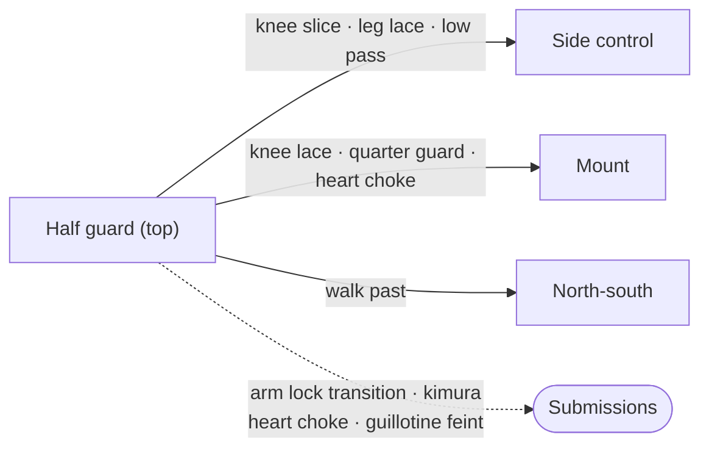

# Half Guard — The Top Game

If [Half Guard Bottom](03-half-guard-bottom.md) is about surviving and attacking from the bottom of half guard, this page is about finishing the job from the top. Your opponent has one of your legs trapped. Your goal is to free it, get past their guard, and advance to side control, mount, or the back. The tools at your disposal range from the systematic (the knee slice) to the opportunistic (the heart choke, the arm lock transition) — and the obstacle you will face most often is the knee shield.

This is the page where more material converges than anywhere else in this reference, because half guard top is where your passing game lives. The knee slice is the primary passing tool on this page, but it is not the only one. The toreando, the leg lace, the low pass with back exposure, and the quarter guard to mount progression all have their home here.

All descriptions assume your right leg is trapped in your opponent's half guard.

---

## From Here

Where this position leads. Details for every arrow are in the sections below and in the [position map](../position-map.md).

---

## 4.1 Principles of Passing from Top Half Guard

The game from top half guard has a clear sequence of objectives:

1. **[Win the underhook](01-foundations.md#12-the-underhook).** Get your right arm under their left arm and onto their back. This connects you chest-to-chest and begins to shut down their offense.

2. **Flatten them out.** Push their left shoulder to the mat. An opponent on their side can bridge, shrimp, recover guard, and attack. An opponent flat on their back with their head turned away is dramatically more limited.

3. **Establish head control.** Once you have the underhook and have flattened them, bring your left arm under their neck and clasp your hands. Drive your left shoulder into their jaw — the [crossface](01-foundations.md#13-the-crossface) — to force them to look over their far shoulder — the crossface. They cannot bridge toward you if their head is twisted away.

4. **Pin their far leg.** This is the step that many people skip, and it costs them the pass. Use your left leg to hook on top of their right leg, pinning it to the mat. Without this hook, your opponent can open their legs and recover closed guard the moment you try to advance — and if that happens while your posture is broken and your arm is exposed, you go from near-dominant to a bad position instantly.

5. **Free your leg and advance.** Once you have all four elements — underhook, flat opponent, head control, and leg pin — you can walk into side control. The pass becomes a formality.

### The Underhook Battle from Top

The underhook is the same battle described in [Half Guard Bottom](03-half-guard-bottom.md), viewed from the other side. You are trying to get your right arm under their left arm. They are trying to get their left arm under your right arm.

Key details from the top perspective:

- **If they get the underhook:** their arm is strong when bent and tight to their body. To neutralize it, bring your weight down on their underhooking arm to straighten and flatten it against their hip. You can drop your right side onto their arm, then swim your left arm across their body to their right side, and begin working down toward their legs with your body pressed against their side.

- **When they have the underhook and you cannot flatten it:** you can drop your left hip and expose your back to them, facing toward their legs. This is the low pass with back exposure, covered in [Section 4.5](#45-the-low-pass-with-back-exposure). It is an advanced and somewhat counterintuitive technique, but it works because it pins their underhooking arm between the mat and your back.

### The Neck Brace Counter

If your opponent gets the underhook and starts looking to wrestle up or take your back, and you need to recover quickly: reach across with your left arm, cup the back of their neck, and brace your left wrist across their neck. Push — this creates discomfort and a pocket of space. Use that moment to slip your right elbow close to your chest, down, and under to recover the underhook or at least return to neutral. This opportunity is brief — take it when it appears.

---

## 4.2 The Knee Slice

The knee slice is the workhorse guard pass from top half guard: the primary tool for getting past your opponent's legs and into side control. The whole decision tree, including every answer to the knee shield, is drawn in [chains/01-knee-slice.md](../chains/01-knee-slice.md).

### Basic Mechanics

Your right knee is on your opponent's right inner thigh, pinning it to the mat. Your left leg is behind you, foot on the mat, providing base and drive. You establish an underhook with your right arm under their left arm. You slide your right leg all the way through — like a baseball slide — past their right leg. Only then do you pivot your hips and bring your knees tight to their side for side control.

### Weight Distribution

A common error: resting the full weight of your knee on your opponent's thigh with your knee hovering above the mat. This creates a gap they can exploit to pull their leg through. Instead, bring your right knee all the way to the mat so it is your upper shin pressing against their thigh. The shin does the slicing, not the knee. No gap, no escape.

### Drive with the Back Leg

Get off your left knee. Get on your left foot and push. This generates the forward drive that flattens their far shoulder and keeps the pressure on. If you are in a plank position with your hips low and legs extended, you have no drive. Your hips should be relatively high — a pyramid shape — with your weight pressing down through your shin and shoulder.

### The Safety Rule

Never swivel your hips toward side control until your right leg is completely free. If your opponent clamps onto your leg while your hips are turned, you can seriously twist your knee. Complete the slide first, then pivot.

### Entering the Knee Slice

**From closed guard:** Break the guard, wedge your right knee under their hips, push down on their right knee, and slip your right knee onto their inner thigh (see [Closed Guard to Knee Slice](02-closed-guard.md#closed-guard-to-knee-slice)).

**From the toreando:** When your opponent extends a leg between yours during a toreando pass, drop into the knee slice — right knee pins their extended leg, establish head and arm control, proceed to pass (see [Open Guards](05-open-guards.md)).

**From [butterfly guard](05-open-guards.md#passing-butterfly-guard-from-the-top):** Pick a side, push one hook to the mat, splay your far hip, and settle into half guard. The knee slice is immediately available.

### When the Knee Slice Fails

The most significant vulnerability: your right ankle is exposed when you enter the knee slice. A savvy opponent will grab it and establish a de la Riva or [reverse de la Riva](05-open-guards.md#53-reverse-de-la-riva) hook. If you do not address this quickly — by standing up and straightening your leg to break the connection — they can sweep you and come up on top.

When this happens consistently, consider switching to movement-based passing: [toreando](05-open-guards.md#56-passing-open-guards-the-toreando-system), [over-under](05-open-guards.md#the-over-under-pass), or [double-under](05-open-guards.md#the-double-under-pass) passes. The knee slice works best as a primary weapon, not an only one.

---

## 4.3 Defeating the Knee Shield

The knee shield is the most common defense you will encounter when passing half guard. Your opponent turns to their side, keeps your right leg trapped with their right leg, and raises their left knee across your stomach or hip as a barrier.

### Approach 1: Push the Knee Through

Win the hand-fighting battle to free your left hand, then push down on their left knee all the way to the mat. This forces them to twist to their right with their left hip stacking over their right. Now drop your right hip and begin pulling your right knee through. Use your left hand to push back on their right knee to prevent guard recovery.

**The timing variation:** push into their knee shield to create tension. When you feel them pushing back, suddenly create space and guide their left knee through behind you with your left hand. They are already pushing outward — you redirect it. Drop the hip and slice.

### Approach 2: The Reset

Instead of fighting through the shield, reset the position entirely. Push your right arm against the left side of their rib cage while your left hand grabs their right knee and elevates it. Drive their back flat to the mat with their knees in the air. Bring your right elbow inside their left knee. When you re-enter the knee slice, the shield is cleared.

### Approach 3: Threaten the Toreando

From the reset position — knees elevated, back flat — swing your right leg behind you and around to your left side, as if executing a toreando pass. Your opponent will chase the leg, possibly threatening de la Riva with their right leg. If they straighten their right leg to follow — their knee shield is gone. Return to the knee slice and slice through.

The toreando threat and the knee slice are two sides of one coin. The threat alone often clears the path.

### Approach 4: The Leg Lace

Thread your right arm under their left leg and over their right thigh, punching your fist to the mat. Turn your fist to cup the top of their right thigh. Place your left hand on their right knee as well.

**The critical detail:** lower your head and shoulder to compress their knees together. Stay low — close to their legs, not looming over their upper body. If you are too high, they can kick through the lace and start threatening an omoplata. If you are low, their legs are too short to reach.

Sprawl to free your right leg. Tuck your head to the mat near the crook of their hip to block their right knee. Walk your legs around to side control, keeping your left hand on their right knee throughout.

**If they straighten their legs during the sprawl,** do not keep walking around. Drive forward and close the distance — you end up in a better half guard position with the knee shield already cleared.

### Approach 5: Stand Up

Sometimes the simplest answer. Standing up forces your opponent to reset to a different guard. Re-engage with a toreando or drop back into the knee slice from standing.

### High Knee Shield vs. Low Knee Shield

The above approaches address the low knee shield (shin across your stomach and hip). The high knee shield — knee near your neck and shoulder — requires a different response: push their knee across their body to flatten their hips to the mat. This converts the high shield into an open guard situation, and you re-engage your passing game.

---

## 4.4 Switching the Knees — Passing to the Opposite Side

Instead of fighting through the knee shield on the same side, you can switch your opponent's knees entirely to the opposite side.

The manipulation: use your left hand to grab their right knee and pull it off the mat while your right hand pushes against the left side of their rib cage. Continue the rotation until their right knee flattens on top of their left knee on the opposite side. Their left knee is now pressed to the mat with their right knee stacked on top.

### The Opposite-Side Smash Pass

Drop your chest to smash their stacked legs. Bring your right elbow to the mat to prevent their left knee from coming up. Stay very low, collapsed on their knees, and sprawl through to pass to your right.

### The Knee Lace to Mount

This is one of the highest-percentage half guard passes.

After switching their knees, drive your left leg between their left and right legs so your left knee presses against the mat — blocking their left leg from recovering guard. Bring your weight down on their right knee.

Exert crossface pressure: grab their head, drive your left ear into the right side of their head, forcing them to look away from their knees. Walk your body up along theirs while keeping chest pressure on their smashed knees.

The crucial step: bring your right knee up and past both their right and left knees. Your left knee is doing the lacing — it sits between their legs, preventing the left leg from coming through (the same job your arm would do in a smash pass, but with your knee instead). Your right knee clears past everything.

Retract your left knee from between their legs. You land with your left knee on the right side of their right hip — in mount.

The full sequence: switch the knees, lace your left leg, crossface, bring your right knee past, unlace into mount.

---

## 4.5 The Low Pass with Back Exposure

When you cannot win the underhook — or they have it and you cannot flatten it — this technique offers an alternative path. (The bottom player's defense is in [Half Guard Bottom](03-half-guard-bottom.md#the-low-pass-with-back-exposure).) It is counterintuitive — you deliberately expose your back — but effective.

Swim your left arm under their right arm, then drop your left hip to the mat so the left side of your back goes across their stomach. You are now facing their legs with your back to them.

Key details:
- Get your back as high on their chest as possible, pinning their left arm between the mat and your back with minimal leverage
- Keep your right shoulder low and tight to their ribcage — if it lifts, they can grab it and attack your back
- Stay tight to their hips with your hands, keeping your center of gravity low
- Trap their right leg between your left leg (under) and right leg (over) for additional control

From here, post on their left knee with your right hand and begin freeing your trapped right leg. You will likely end up in quarter guard — your right ankle still caught. When that happens, drop your right knee to their left side so you are in an almost-mounted position. Swim your left arm back over to their right side. Drop your head next to theirs on your left side, use your right arm for head control.

Now — with all your weight on the left side — you can safely use your left shin as a staple on their right inner thigh to pry their grip open and free your right leg into full mount. Normally a staple from this position would let them sweep you, but with all your weight committed to the left, the sweep is nearly impossible.

---

## 4.6 The Heart Choke

The heart choke works from both half guard top and [side control](06-side-control.md#the-heart-choke-from-side-control); finishing mechanics are in [Submissions](../submissions.md#1110-heart-choke). It is a shoulder lock that uses the opponent's own arm pinned across their chest.

**From half guard top:** As you work to flatten your opponent, they will brace their wrist against your collarbone or neck. Create maximum pressure into that brace — you want them pushing back hard. Then drive your right shoulder across their brace, pinning their left arm against their chest with your chest weight.

Often they will see your left arm exposed and reach for a [kimura](../submissions.md#113-kimura). Break their grip by bringing your left arm down across your knee. Now reach your left arm around the right side of their head, under their neck, and establish a figure-four: your left arm clasps your right bicep, your right hand goes over their eyes, like a front-facing rear naked choke.

Continue flattening them. The pressure falls on their shoulder joint or pectoral. Use this pressure to transition to mount: sprawl on your left leg to free your right, bring your right knee up into mount, re-establish the figure-four, and finish.

If they turn to their side to relieve the shoulder pressure, transition to the [gift wrap](07-mount.md#the-gift-wrap-to-back-control) — feed their left arm across, secure with your right hand, slide your right knee behind their back, and roll into back control.

---

## 4.7 The Knee Slice to Arm Lock Transition

When the knee slice stalls against a knee shield, this fast transition both clears your trapped leg and threatens a submission.

From the knee slice position with a knee shield in: reach behind their head with your left arm as if threatening a [guillotine](../submissions.md#116-guillotine) or [anaconda](09-front-headlock.md#92-the-anaconda-choke). This is misdirection — your opponent braces for the head attack. Instead, plant your left fist against their back and pull their head toward you, creating space for your left leg to step over their head.

Pivot on your left leg and turn your hips 180 degrees clockwise. This rotation naturally straightens your right leg and pulls it cleanly out of their half guard (no twisting). Your right leg comes across their face into [armbar](../submissions.md#111-armbar) position on their left arm. Your left knee rises to complete the lock.

**If they block the arm lock** by getting their right arm under your right leg: you have options. Continue the rotation and pass into side control on the opposite side, or settle into north-south position and work for back control. Or step back and use the arm lock threat as a feint to re-enter the knee slice from a new angle.

This transition also chains into deeper sequences: from the north-south position you can sprawl to collapse their arms and look for an anaconda or [front headlock](09-front-headlock.md), or switch your arms to a seatbelt and take the back directly.

---

## 4.8 The Guillotine Feint and the Knee Pinch

Two improvisational techniques that emerge from the knee slice position.

**The guillotine feint.** When your opponent tightens up against the knee slice — head down, scrunching close — their neck is exposed. Threaten a guillotine with your free left arm. When they react (reaching for your arm, pulling their head back, loosening the knee shield), slide your right knee through past the shield directly into mount.

**The knee pinch.** Instead of pushing the knee shield down or through, push it laterally — toward their other knee. Pinch both knees together on the mat. Carefully extract your right leg and hop over their pinched knees to pass to their left side. Their back is partially exposed, creating a scramble opportunity for back control.

---

## 4.9 Countering the Underhook Escape

When your opponent gives up the knee shield but gets an underhook under your right arm with their left arm, they are beginning to [wrestle up](03-half-guard-bottom.md#35-the-wrestle-up) (the bottom player's view of this battle is [chains/02-half-guard-wrestle-up.md](../chains/02-half-guard-wrestle-up.md)).

Counter: turn to your right and throw your left arm over their left shoulder. Both arms over their left shoulder straightens their underhook and removes its leverage. Drop your left hip to the mat — glue it to their stomach — so your hip blocks their legs from recovering guard.

From here you can progress to a kimura on their straightened arm or re-establish your passing position.

### When They Trap Your Leg and Rock You Across

A specific version of the same battle, from the [staple pass](03-half-guard-bottom.md#the-staple-pass). You have them flattened, head control established, passing on their right side: your left shin is stapling their right thigh and you are pulling your right leg free. Their common defense is to clamp their thighs together on your right leg and turn their hips from their right side to their left, rocking you across their center line. To keep from being rolled you have to let go of head control and post. The instant you post, they take the underhook with their left arm and — legs still squeezing your right leg — rock you back across, establishing a body lock and starting to come up or hunt a butterfly sweep.

If you know that is their one defense, you can use it ([Foundations](01-foundations.md#16-action-and-reaction)). When they rock you back, do not fight to re-establish your original position — you would be doing it with their underhook already in place. Instead, stay over their center line, and as they turn back, drop your left hip. This exposes your back to them, but you keep control of their right thigh so they cannot escape, and you bring your left side down onto their underhook, pinning it to their body. It is now a dead underhook, because you have collapsed onto it. From here: attack the kimura, work to free your legs and step through, or anything else that starts from a pinned arm.

Their only answer is to anticipate *your* anticipation — as you drop the hip, brace their right arm against your left hip to keep it elevated, then push your back down or work their knee through. The chain of give and take runs as long as both people can read it.

---

## Summary

Half guard top is where your passing game converges. The knee slice is the primary tool, but the knee shield will force you to adapt — through resets, toreando threats, leg laces, or switching sides entirely. The knee lace to mount is among the highest-percentage routes to mount. When the knee slice stalls, the arm lock transition, guillotine feint, and knee pinch give you alternative paths.

Every pass from this page delivers you somewhere: [side control](06-side-control.md), [mount](07-mount.md), or the back ([Back Control](08-back-control.md)). And the techniques your opponent uses to defend — the knee shield, the underhook, the wrestle-up — are exactly what [Half Guard Bottom](03-half-guard-bottom.md) taught them to do. The two pages are a conversation between two players, each trying to execute their half guard game.
