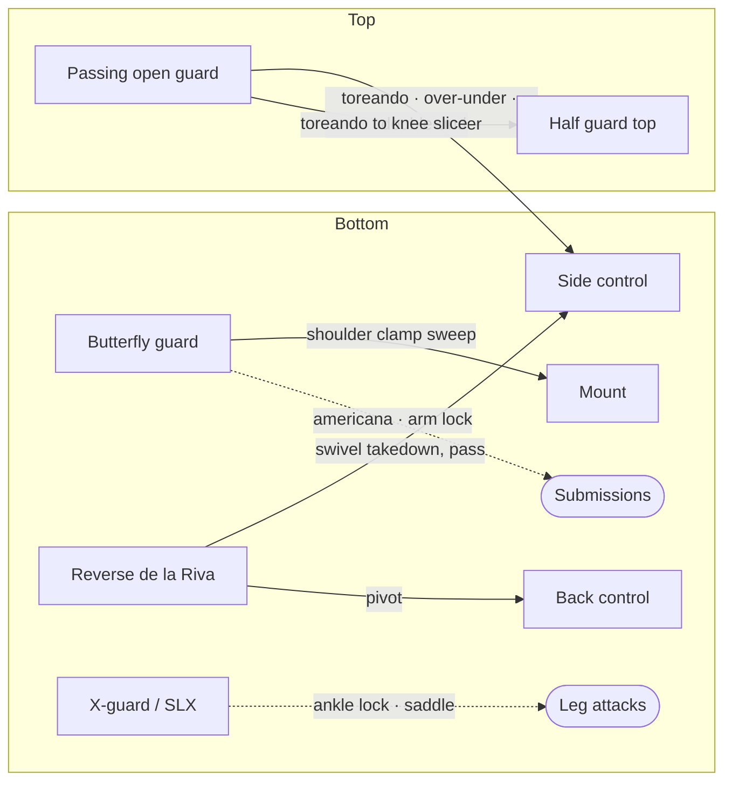

# Open Guards, Butterfly Guard, and Passing Systems

When closed guard opens up — or when your opponent is standing and you are seated — you enter the world of open guards. These are the positions where your legs are between you and your opponent but are not locked together: butterfly guard, de la Riva, reverse de la Riva, single leg X, and X-guard. Each creates different kinds of control and different attacking opportunities.

This page covers several different guards, so each section states its own side. Unless a section says otherwise, bottom-game descriptions assume your opponent has stepped in with their right leg, and top-game descriptions assume you are passing toward their right side.

This page also covers the shoulder clamp system, which bridges butterfly guard, half guard, and closed guard into a unified attacking framework, and the passing systems — toreando, over-under, and double-under — that you use to get past open guards from the top.

---

## From Here

Where this position leads. Details for every arrow are in the sections below and in the [position map](../position-map.md).

---

## 5.1 Butterfly Guard

Butterfly guard is a seated guard where both your feet are hooked under your opponent's thighs, with your knees pointing outward. It is an active, dynamic guard — not a position where you hold your opponent in place, but one where you are constantly threatening sweeps and off-balancing.

The key to butterfly guard: your hooks should elevate with your ankles, not by pinching your knees together. Let your legs splay outward and lift with the insteps of your feet. Pinching your knees gives your opponent something to push against and makes your hooks easy to clear.

### Passing Butterfly Guard (from the top)

The cardinal rule: do not walk straight into a butterfly guard where both hooks bear your weight evenly. You must pick a side.

If you prefer to pass to your left (their right side), push their right butterfly hook to the mat with your left hand. They will still have their left hook under your right hip and can try to elevate and sweep. The counter: splay out your right hip, distributing your weight far back. It becomes extremely difficult for them to sweep — even if they briefly elevate your hip, your weight slides off the hook and drops back to the mat. From here, you settle into their half guard and begin your passing game (see [Half Guard Top](04-half-guard-top.md)).

### Giving the Underhook

Some butterfly players are passive — they only look for a hook once you have engaged in half guard. Others are genuinely active: sitting up, legs spread, trying to get you to walk into both hooks, and threatening leg locks if you try to step through. Against that kind of guard, the pass is a give-to-get ([Foundations](01-foundations.md#16-action-and-reaction)).

You are on your knees above them. Post your right hand on their left shoulder and press your left palm down on their right inner thigh — a standard way to engage, pushing them to one side. Note that this pass finishes on their *left* side — the opposite of the basic pass above — because you are going to sink onto the underhook they take on your right. Normally you would be very defensive with that right arm, bracing it against their shoulder so their left arm cannot work under it for the underhook. Here you want the opposite: let them have it. An active butterfly player will scoot in and take the underhook under your right arm, because that plus their left hook under your right thigh is their sweep — kick through with the left leg, flip you to your left, land in mount or better. The whole technique depends on them having leverage to take you to your left.

As they scoot in and establish the underhook, lean hard on it to your right. They technically have an underhook, but it is a dead one — the ["killing the underhook" idea from half guard top](04-half-guard-top.md#the-underhook-battle-from-top). Sink down onto your right side, put all your weight on that underhook, and do not let their left leg kick through. At the same time, bring your left arm up from their thigh to underhook their right arm while you smash their left underhook flat. Because you were waiting for it, this catches them by surprise.

The step that cannot be skipped: immediately sprawl your left leg and bring your left thigh to the mat. Their right foot is still hooked under your left thigh, and if you leave it there they simply sweep you the other way. Kill that hook by sprawling as you pass on their left side. Then step your right foot up past their left knee and you are in a very dominant half guard: flatten them, establish head control, and start the leg staple and pass ([Half Guard Top](04-half-guard-top.md)).

---

## 5.2 The Shoulder Clamp System

The shoulder clamp is one of the most versatile attacking systems in no-gi ([chains/07-shoulder-clamp.md](../chains/07-shoulder-clamp.md)). You can enter it from butterfly guard, half guard, or closed guard. It creates sweeps, arm locks, and transitions to mount.

### Entering the Shoulder Clamp from Butterfly Guard

From seated butterfly guard, fight the hands to distract your opponent, then establish an underhook — say your left arm under their right arm. Swing your right arm over their left shoulder and clasp your hands behind their back in a gable grip.

Your opponent will try to bring their left arm across your face and brace against your neck to push you off and break the grip. To prevent this, dig your forehead into their chest. They cannot get the brace across with your head in the way.

Now you have two paths:

**Path 1: Pull them into your butterfly guard first.** Scoot your hips in close, lie back, and pull them forward into your butterfly hooks. Let your legs splay and let their weight sink in. When they post both hands on the mat to stabilize, that is the moment to bring your right forearm across their face and establish the shoulder clamp — your right forearm under their chin, gable grip clamping down on their right shoulder.

**Path 2: Go straight to the clamp.** Bring your right elbow up over their head and across their face, sit your forearm under their chin, and readjust your grip to choke up on their right shoulder. Create tension between the clamp on their shoulder and the pressure of your forearm on their neck.

### The Shoulder Clamp Sweep (to your left)

With the clamp established on their right shoulder: kick your left leg out to clear their right knee off the mat, and as you kick through, stay connected with their right leg and elevate it so they cannot rebase. Simultaneously kick your right butterfly hook across their body. The combined forces sweep them to your left (their right), and you end up in full mount with their right arm splayed out.

**From mount with the splayed arm:** Keep your left hand under their right arm, chest pressure pinning it to the mat. You can even put your forehead on the mat for stability. When they try to pull their arm back and bring their fist toward their head, this feeds directly into an americana — your left arm is already under their right arm, and you just bring your right elbow near their ear, grab their wrist, and finish.

### The Shoulder Clamp Sweep (to your right)

If they defend the first sweep by gripping your head and working for an underhook with their left arm: clamp their left arm to your side with your right arm, and kick your left butterfly hook to sweep them in the opposite direction. They land in exactly the same mounted position — right arm splayed — and the americana is available from the same setup.

Two sweeps in opposite directions, both ending in the same submission opportunity. The opponent's defense to one feeds directly into the other.

### The Shoulder Clamp to Arm Lock

If you have the clamp on their right shoulder and they shift all their weight to their left (your right) to avoid being swept: transition to an arm lock.

Shift their clamped right arm so it falls into the pocket between your shoulder and chin. Clamp down. Shrimp out onto your right hip, elevating your left hip off the mat. Swing your left leg up across their shoulders, bring your right leg across their upper chest, and pinch your legs together to hold them in place.

Bring your head slightly up their arm to further straighten it — this also prevents them from gripping the back of your head. Use your right hand to rotate their elbow outward, then pull down with both arms. The arm lock is fast and powerful.

**The Marcelo Garcia variation:** If you cannot get them to either side and they are sitting in your butterfly guard, elevate them with both hooks while sitting up. Their arm, which was on your chest, is now resting on your shoulder with a gap underneath. Turn their elbow and pull down — a quick arm lock that comes on fast with limited control. An advanced technique, but worth keeping in your back pocket.

### The Shoulder Clamp from Closed Guard

From closed guard (described on the opposite side from the butterfly entry above — see [The Shoulder Clamp from Closed Guard](02-closed-guard.md#the-shoulder-clamp-from-closed-guard)), if you have clamped their left shoulder between a gable grip — left elbow under their chin — you can release your closed guard, transition through high guard to butterfly guard, and use your butterfly hook to sweep them directly into mount. The shoulder clamp bridges all three guards (see [Closed Guard](02-closed-guard.md) for the closed guard entry).

### The Shoulder Clamp from Half Guard

From bottom half guard, the shoulder clamp to arm lock transition is covered in [The Shoulder Clamp to Arm Lock](03-half-guard-bottom.md#the-shoulder-clamp-to-arm-lock).

---

## 5.3 Reverse De La Riva

The reverse de la Riva is the open guard this page builds on for when your opponent is standing over you. It is more effective in no-gi than the standard de la Riva, and it is the guard you will find yourself in most often when someone steps between your legs.

### Setting It Up

Your opponent is standing and steps their right foot between your legs. Before they can advance: use your left hand to brace against their shin, just below the knee, thumb down. You want to prevent them from stepping deep.

To enter the reverse de la Riva: grab their right ankle with your right hand, and snake your right leg behind their right thigh so that your right ankle hooks on the outside of their right hip, where their leg meets their torso. Your right thigh rests on their shin. Their right leg is now trapped between your right hook, your right arm controlling the ankle, and the tension your legs create.

### The Traditional Sweep

**Tension is the guard.** Before any technique: the reverse de la Riva only works if there is real tension in the hook. A passer's simplest answer to this guard is to extend their right leg, push your left foot off their hip, and [knee slice](04-half-guard-top.md#42-the-knee-slice) straight through. That works when the hook is loose. If your right leg is wrapped tightly around their leg with a lot of tension, they cannot turn their knee the way a knee slice needs — they cannot turn it to their left, drop the hip, and kick the leg through, because you are wrapped around exactly that. And if they try to turn the knee the other way, their hips come over yours, which is dangerous for them: you can toss them over you and force them to post. The retention lives in the tension, not in a move.

The same tension is what makes the sweep work when they are standing. Pushing with your left foot on the hip while your right hook lifts their right leg is effectively a single leg — you elevate the leg with your leg and push down on the hip the way you would push with a shoulder. Without the tension on the leg you have nothing; you are just pushing, they extend, and their knee slice starts.

Take your left foot and place it on their right hip bone. Push with your left foot while pulling their right ankle toward you with your right arm. The push-pull unbalances them and can drop them. Follow their ankle all the way up — you end up in a knee slice position in their half guard.

**The danger:** resting your left foot on their hip opens you to several attacks. They can control your ankle and push it across their body, opening your left side for a pass. Worse, there is a fast submission — the [Estima lock](../submissions.md#estima-lock) — where they trap your ankle under their ribcage and apply a guillotine-like grip on your ankle, then rise up. It comes on very quickly.

For these reasons, do not leave your foot on their hip. Push to unbalance briefly, then immediately transition to the swivel takedown below.

### The Swivel Takedown

This is the highest-percentage technique from reverse de la Riva, and the one to build the guard around.

Drop your left foot from their hip and use it to kick down and generate momentum. Pivot 180 degrees, swiveling around their right leg. Bring your left shoulder to rest behind their right kneecap, controlling their knee and shin with your arms.

The critical detail: keep your right leg (the de la Riva hook leg) in an S-position as it drops down. Your right thigh overlays on top of their right foot, trapping it under the S-shape of your bent leg.

Now the takedown: do *not* try to drive forward with your left shoulder behind their knee. That is the minor part. The major part is bringing your right leg back — pulling that trapped right foot back with it. This is what actually takes them down. They have no choice but to fall.

This is wrestling, and wrestling is explosive and fluid, not brick by brick. The moment you S-sit, you must already be pulling your head back and driving into the back of their knee. Step by step — swivel, settle, then slowly push — gives them time to sit their weight back onto you and start attacking your leg. If the explosiveness is not there, move on to something else. You do not sit and wait in this position.

When they sit, maintain control of their right leg with your right arm and reach for their left ankle with your left arm. Keep your shoulder and head glued to the pocket of their hip. Stand up and pass into side control on their right side.

If they keep their left ankle away, pivot toward their back instead — take your left arm to the outside of their left hip and start working for the [back take](08-back-control.md#from-reverse-de-la-riva).

### Transitioning to De La Riva

Sometimes your opponent starts pushing on your de la Riva hook or trying to control your ankles. You can release the hook, use your right foot to push on their inner right thigh, and swivel your left leg around their right leg to rest your left ankle in their hip crease. Switch your grip from your right hand to your left hand on their ankle. This is the standard de la Riva.

Important note: the standard de la Riva is less effective in no-gi because there are no collar or sleeve grips to stabilize the position. In no-gi, treat it as a transition state — a way to reset and get back to reverse de la Riva rather than a position to play from.

---

## 5.4 Dealing with De La Riva and Reverse De La Riva (from the Top)

When your opponent enters the reverse de la Riva against you — say their right foot hooked on your right hip, their right arm controlling your right ankle:

**The [Estima lock](../submissions.md#estima-lock).** Lean down and trap their left ankle — the foot they are pushing on your hip with — in the crook of your waistline, between your lower and upper body. Get a guillotine grip on their ankle and rise up. It comes on very fast. Note: this may not be legal at all belt levels; check the rules.

**The [toe hold](../submissions.md#toe-hold).** Reach around with your left arm and grip the other side of their left ankle, grab their foot, and attack. This is typically not allowed at white and blue belt.

**The passing option (most realistic).** Get control of their left ankle as they push against your hip. Use their momentum to channel their leg across your body, then bring it all the way down to the mat. As you do, place your right knee on top of their left thigh, collapsing their legs on each other. Keep pressure on their legs and pass to their back.

**The ankle lock from the hip.** When their foot is on your hip bone, you can bring your right arm under that leg, pull their foot up to your ribcage, wrap a rear-naked-choke style grip on their ankle, and bridge up to apply the ankle lock. This is legal at white and blue belt despite resembling a toe hold. If they move their foot out of the way, you can start to pass.

---

## 5.5 X-Guard and Single Leg X

These are leg entanglement guards that create powerful sweeps and set up ankle lock attacks. They are entered when your opponent is standing over you.

### Single Leg X Guard

Control your opponent's right ankle with your left hand, gripping the Achilles. Start with both feet pushing against their hip bones to keep distance. Then swivel your left leg under their right leg and around so your left heel rests on their right hip bone with your toes pointed outward. Clamp your right shin against the inner thigh of their right leg. Wrap your left arm around their right ankle like a guillotine grip.

**Important:** do not let your left leg cross past the center line of their torso — this is called reaping and is illegal at white and blue belt. Keep it on their hip.

**The hip shrug takedown:** Lift your hips off the ground, tweak them out to your left (their right) so their knee turns outward, then push through and back. They tip toward the tweaked knee and fall into your control — you can finish with an ankle lock or stand up with their leg controlled and begin passing.

**When they clear your hooking leg:** As soon as they push your left ankle off their hip, your hips will drop and you are in a bad position. Be ready: immediately swim your left leg under and around their right leg, hooking your left ankle on the inner thigh of their left leg. Bring your right leg up and hook it behind their left knee or calf. This traps their left leg between your left ankle hook and your right leg.

### Entering from Butterfly Guard

This is the most common entry. You are seated in butterfly guard, your opponent approaches on their knees and steps in with their right leg. Threaten an ankle pick with your left hand on their ankle and your right hand pushing their inner thigh. Then butt-scoot, shoot your left leg under their right leg, bring it around, and hook into single leg X. Clamp in.

### X-Guard

From single leg X, if you get a deeper position: take your right hand and grab the back of their right knee, then release the guillotine grip on their ankle and swim your arm around so their ankle is trapped over your shoulder. This creates a forced split and further unbalances them. When you ultimately stand to complete the sweep, their leg is on your shoulder.

### The Ankle Lock from X-Guard

After sweeping them down from X-guard — maintaining your grip around their right leg in a guillotine configuration — you can transition directly to an ankle lock.

**Finishing the ankle lock.** Wrap their ankle like a guillotine: your arm over and around, your other hand gripping your wrist. If you are too high on their shin, sit up and lean back to slide the grip higher onto their Achilles — you want to be choked up right on the ankle, not mid-shin. Pull your wrist to your chest to cinch the grip.

To finish: turn to the side of the wrapping arm. Ideally turn all the way to the mat, looking over your shoulder — you have effectively rotated 180 degrees with your back toward your opponent. Bridge into their leg and pull back with the guillotine grip. The combination of the bridge and pull creates the breaking pressure.

**When they escape to the other side.** If your opponent clears your hooking leg off their hip, steps over it, and starts to free their trapped leg, their movement often brings their other leg into contact. Simply take your free leg, hook it around and under their other leg, and clamp for an ankle lock on the opposite side — it is often even tighter than the first.

**Defending the X-guard ankle lock:** Sit up immediately, reach forward, and grab their near arm to prevent them from bridging back. Then post your far hand on their bottom ankle, lift your hips to clear over their leg, and make sure your trapped leg stays pointed upward — if it points down, they can transition to a belly-down ankle lock.

### The Saddle / Reverse Saddle Entry

From butterfly guard or when threatening a knee slice, you can step your right leg between their legs, pivot 90 degrees so your chest faces the same direction as theirs, and fall back onto your butt with their leg trapped between yours. From here you can attack ankle locks or enter the checkmate position by grabbing their other leg and bringing it over the top of their trapped leg, then wrapping your arm around it.

**Safety note:** Figure-four your legs so your right heel is not exposed. An extended right leg is vulnerable to heel hook attacks.

---

## 5.6 Passing Open Guards: The Toreando System

The toreando pass is a movement-based passing system used when your opponent is on their back with their knees up and you are standing or kneeling over them. It pairs naturally with the knee slice — the toreando creates openings for the knee slice, and the knee slice creates openings for the toreando.

### Getting to the Starting Position

Your opponent is seated in butterfly guard or open guard. Feint — reach for their head with one hand, their wrist with the other. When they react, reach down, grab their heels, and pull back to bring them onto their back. Transition your grips so your open palms rest on their upper shins, pressing their knees into their body.

### The Basic Toreando

If passing to their right side: move your right hand from their shin to their lower left ribcage. Push the inside of their right knee with your left arm to drive it all the way to the mat — this is called "killing the knee." Their right knee is on the ground, their left knee is elevated, and their legs are splayed.

Shuffle your feet around to their right side. Keep your left arm pushing on top of their right knee to prevent guard recovery. Drop your left shoulder onto their chest and clamp your right arm on their hips or work for the underhook. When they bridge and come back down, slip your left arm under their head for head control. That is the traditional toreando.

### Toreando to Knee Slice

If they push their right leg between your legs to block the shuffle: drop directly into a knee slice. Right knee pins their right leg to the mat, establish head and arm control, and pass (see [The Knee Slice](04-half-guard-top.md#42-the-knee-slice)).

### Dealing with De La Riva During the Toreando

If they establish a deep reverse de la Riva during your toreando attempt: cup their right knee, stand up and shuffle sideways. Use the cup on their knee to turn their hips across their body. Collapse both knees together on the opposite side and smash down. Get your right elbow to the mat close to their body. Staple their top leg with your left shin — this is the critical detail, because the top leg is the one they will use to follow your passing leg and maintain the connection. Then sprawl through to pass.

### The Over-Under Pass

From the toreando position, if your opponent has their left leg elevated and is looking to pummel it over your right arm: swim your right arm under their left hip, grip it close, and drive it to the mat with your right shoulder. Take your left hand (from their right knee) and feed their right leg between your two legs, trapping it by clasping your legs together. Stand up on your toes, keeping their right leg trapped. Swim your right leg over their right leg while driving your left leg into it to break their connection. Pass into side control.

### The Double-Under Pass

If the over-under is not connecting on their right leg: shift your hips to walk toward their left side. Swim your left arm under their right leg. Clasp your hands in a gable grip. Pull their hips up onto your hips, wedging your knees underneath. Walk your way into side control on their right side while keeping pressure on their legs.

---

## Summary

Open guards are where jiu-jitsu becomes most dynamic. From the bottom, butterfly guard and the shoulder clamp system give you sweeps and arm locks. Reverse de la Riva gives you the swivel takedown and back takes. X-guard and single leg X give you sweeps and ankle locks. From the top, the toreando system gives you a movement-based passing game that pairs with the knee slice from [Half Guard Top](04-half-guard-top.md).

The shoulder clamp system is worth particular attention — it creates identical outcomes (mount with the americana available) from two different sweep directions, making it extremely difficult to defend. It works from butterfly guard, half guard, and closed guard, giving you a unified attacking framework across multiple positions.

In no-gi, reverse de la Riva is the open guard to build on. Standard de la Riva is a transition state. And the swivel takedown — using your back leg to pull their trapped foot, not driving with your shoulder — is the highest-percentage technique from it.
