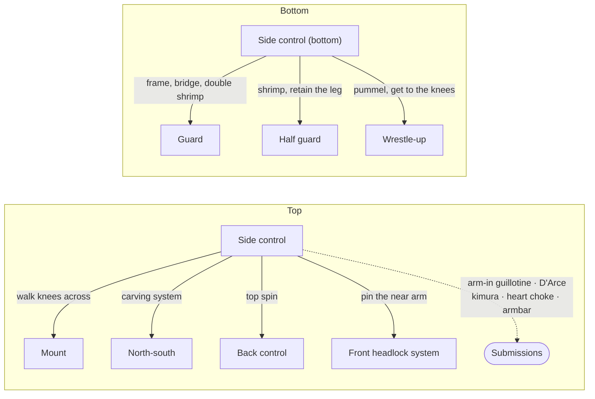

# Side Control — Consolidating Your Advantage

Side control is where your guard passing pays off. You have gotten past your opponent's legs — through a knee slice, toreando, smash pass, or any of the other methods in the preceding pages — and now you are chest-to-chest with them, controlling from the side. This is a dominant position. Your opponent's primary goal is to escape; yours is to maintain control, improve to mount or the back, or attack submissions.

This page covers side control from both perspectives: how to maintain it and attack from the top, and how to escape from the bottom. It also covers the transition to north-south, which opens up kimura and armbar threats.

All descriptions assume you are on top, attacking your opponent's right side.

---

## From Here

Where this position leads. Details for every arrow are in the sections below and in the [position map](../position-map.md).

---

## 6.1 Maintaining Side Control

### The Neutral Position

In the basic side control position, your knees are tucked tight against your opponent's right side. Your left arm is under their head, and your right arm is across their chest, wrapped around their left side. Your opponent will typically have two braces in place: their left forearm against your neck and their right forearm against your left hip. They are using those frames to create space so they can turn, shrimp, and recover guard.

Your goal is to move with them, overcome their frames, and prevent them from sliding their knee between your bodies.

### The Crossface

Your most powerful control tool from side control (see [The Crossface](01-foundations.md#13-the-crossface)). Take your left arm under their head, grip their far armpit with your middle finger, and pull them into your body while driving your shoulder across their jaw. This forces them to look away from you. If their head is turned, they cannot shrimp toward you — their body follows their head.

**The weight distribution trap:** As you pull them in with the crossface and clamp with your right arm, it is easy to let your weight drift toward their far side so your head drops lower than your hips. This tips you off-balance, and a good opponent will bridge and sweep you. The fix: even while pulling them into your body, keep your hips sunk back toward your base.

### Pinning the Near Arm

Their left arm — the one nearest your head, bracing on your neck — is the arm to think about. Clamp down on it so it is pinned flush against their side and they cannot push you away. The care point: if you clamp over the top of the arm without keeping your own arm tucked tight, they can slip an underhook and shrimp away underneath the clamp. Pin the arm to their ribs in a way that gives them no path to the underhook.

When they push on your neck with that arm, swim: your right arm goes over their left forearm and under their left bicep, gripping their shoulder and pulling it into your body as you turn them toward you. A great deal opens from here — arm locks, and the front headlock system ([Front Headlock](09-front-headlock.md)) — and all of it comes from control of that one arm.

Two premature moves to avoid. Dropping your hip early relieves every bit of pressure and tension, and gives them a relaxed moment to plan an escape. Attacking their far arm too early — flattening out by dropping your left hip — exposes your back, and a good opponent will take it, or shrimp you off and end up on top. Both are real options *when the timing is right*: if they are bracing on your neck, you can drop to your right hip, let them keep pushing into nothing, and swim under the now-exposed arm; if they go for the underhook while you are lower on their body, drop to your left hip and attack the kimura.

**The far arm, when the time is right.** The other side has its own isolation. If you can scoop their right arm — the far one — and bring it up, then work your left hip and left leg underneath it, you have isolated that arm on the far side instead of the near side. From there the north-south attacks open up on that side, and so does the back. It is a real option, but it is the one most likely to become the premature flattening described above; earn it rather than reaching for it.

**One way to simplify.** There is almost too much available from side control, and most of it comes with an escape attached. A useful default is two things. Plan A: attack the near arm. Plan B: keep moving — switch your arms to the other side and go to north-south ([The Carving System](#the-carving-system)). Treat everything else as secondary until those two are automatic. The shrimp-triggered attacks are drawn in [chains/05-side-control-pressure.md](../chains/05-side-control-pressure.md).

### Blocking the Knee

When you feel them starting to slide their right knee into the gap between your right hip and their body — their primary guard recovery — drop your right hip to the mat. Turn so you are almost facing their head, your right hip blocking their knee from coming through. This is a temporary position — there is not much you can attack from here — so pop back up into standard side control once the threat is neutralized.

**A tricky option from the hip drop:** After you drop your right hip and block their knee, step over their head with your left leg. This is not a direct threat, but when they push against your left leg with their left arm to clear it, that exposes their left arm. Go around their arm with your left arm, pinning their left arm across their body as you return to side control. This is the entry to the heart choke from side control — see [The Heart Choke from Side Control](#the-heart-choke-from-side-control) below.

### Swimming Past the Braces

Your opponent's forearm braces are what keep you from advancing. You need to get past them.

**The neck brace.** When their left arm braces against your neck, snake your right wrist between their bicep and forearm on the top side. Loop it around and under, then clamp tightly on their shoulder. You now have an underhook on their left arm. As you advance up their body, they will likely start to shrimp — but you have that strong clamp on their arm. Windshield-wiper your legs away from their legs (toward their head) so they cannot trap your right leg, then step your left leg over their head behind their shoulder blades. From there you can swivel into an armbar on their left arm.

**The hip brace.** When their right arm braces against your hip, bring your left leg closer to your right knee and swim it around their brace. Try to trap their right arm between your arm and hip by advancing your position up their body. This is harder — they recover the brace easily — so the neck brace swim is usually the better option to prioritize.

### Moving Up Their Body

In general, you want to work your side control progressively higher up their body, toward their head. The higher you are, the less ability they have to insert their knee for guard recovery, and the closer you are to north-south position where additional attacks become available.

---

## 6.2 Attacks from Side Control

### The Arm-In Guillotine

Finishing mechanics for every guillotine are in [Submissions](../submissions.md#116-guillotine); the front headlock page has the [same entry from its side](09-front-headlock.md#the-arm-in-guillotine-from-side-control).

When your opponent shrimps onto their right hip and begins working for the underhook with their left arm — which is their standard escape sequence — you can jump to an arm-in guillotine.

Wrap your left arm around their neck and your right arm around their left arm. Clasp into a gable grip. Do *not* drop onto your back and arch — this creates space and lets them escape. Instead, drop onto your left hip and lean slightly forward.

The guillotine works by closing an aperture between your body and your left arm. You close it not with arm strength but with gravity: position their head between the ground and your body, move sideways across their neck, and let your weight do the work. Dig your chin into the back of their neck and scoop forward. This is how high-level practitioners finish guillotines — not by arching back, but by coming forward and letting gravity close the space.

Use your right leg on the mat to push back and circle away as they try to push forward, maintaining the side position and tightening the grip.

### The D'Arce Choke

Another option when they shrimp and work for the underhook. As their left arm reaches under your right arm for the underhook, wrap your right arm around their left arm — but instead of stopping at the guillotine position, thread your arm across their neck, reaching around the right side of their neck to trap both their arm and their head.

Use your left arm and elbow to push their head down, encouraging them to crunch into their body. This helps you thread your right arm completely through. Grip your left bicep with your right hand, forming the classic figure-four lock — the D'Arce configuration.

Unlike the [anaconda](09-front-headlock.md#92-the-anaconda-choke) (which requires a roll-through), the D'Arce can be finished from side control by grabbing one of their legs to prevent escape and cinching the figure-four. It functions as both a choke and a neck crank. You can also transition to mount for additional finishing pressure.

The D'Arce vs. the guillotine from this position is largely a matter of angle and depth. If your arm threads deep across their neck, you have the D'Arce. If it wraps more around their head, you have the guillotine. Both work when they shrimp and reach for the underhook. See [Front Headlock](09-front-headlock.md) for more detail on the front headlock and head-and-arm system.

### The Kimura from Side Control

Finishing details: [Submissions § Kimura](../submissions.md#113-kimura).

There are several kimura entries from side control. One of the most effective starts from the transition toward north-south.

When you swim past their neck brace and get the underhook on their left arm, begin walking toward north-south. Keep downward pressure with your head on their lower torso — this straightens their left arm. If they try to slip their hand around your head to defend, their arm drops into a kimura grip: grab their left wrist with your right hand, snake your left arm under their left arm, and grab your own right wrist.

From the kimura grip, you can step into technical mount (right leg over their head and shoulders) and finish by pulling their arm up and behind their back. Or you can step your left leg over their chest and pull back for an [armbar](../submissions.md#111-armbar).

### The Heart Choke from Side Control

The heart choke from half guard top — including the figure-four grip that finishes it — is covered in [Section 4.6](04-half-guard-top.md#46-the-heart-choke); mechanics in [Submissions](../submissions.md#1110-heart-choke). From side control, the entry is different, and the finish is the same figure-four. Drop to your right hip, reach across with your left arm to grab their head, and step your left leg over their head. Pull their head across their body with your leg. When they push your leg off with their left arm, go around that arm — your left arm under their head on the right side, pinning their left arm across their body. Return to side control with their arm trapped, drive your right knee into their hips for the twisting pressure, and transition to mount.

---

## 6.3 Transitioning from Side Control

### Side Control to North-South

To transition to north-south: first reposition your arms. Move your left arm from the right side of their head to the left side, tucking your left fingers under their left armpit. Move your right arm from across their chest to their right hip to prevent them from following you.

Their right arm is likely resting on your left hip, blocking your movement toward their head. Clear it by sprawling on your left hip, dropping your weight onto their hand to flatten it. Walk your legs around toward their head. Once their hand is cleared, bring your hips up, tuck your knees in, and settle your weight back — do not sit too far over their chest.

From north-south, push your left hand through their left armpit to elevate their left shoulder and begin twisting them to their right. If their arm rests on top of yours, you can step over into technical mount and attack the armbar. If they clear their arm — which is more common — grip their left wrist with your right hand for the kimura.

### The Carving System

Side control is a hard position to finish from directly: most attacks from it come with an escape attached. It is a way station, and as soon as you arrive you should be thinking about leaving. The carving system is one way out: a transition to north-south that isolates one arm along the way, and then a set of finishes that depend on how the opponent tries to free it.

**The transition.** From traditional side control on their right side — right elbow tucked against their left hip, left arm under their shoulder blades with the hand digging into their left armpit, pulling them into you — take your left arm out from under them and reach across their chest, wrapping their left arm as tightly as you can into the crook of your left elbow, with your left hand resting in the middle of their chest. At the same time, switch your right arm from their left hip to their right hip, crossing their body. And simultaneously, drop your left hip and sprawl as you move toward north-south.

The sprawl is not optional. If you do not sprawl onto your left hip, they shrimp onto their left hip and push you off. If you do, they cannot. You now have their left arm in the crook of your arm, and you want to carry it across as far as possible — often it ends up trapped behind your head.

As you cross to north-south with the sprawl in place, your hip drives into their face and they end up looking to their left. Most people will try to push you across their body. Resist at first so they push hard, then go with it and move all the way across.

**The carve.** This is where the system gets its name. Stop staying sprawled on the mat: lift your hips and drive your left shoulder into their left arm, down the center line of their body toward their waist. With your left arm underneath their left arm, your chest smashing down on top of it, and your full weight coming through now that you are off the mat, the arm becomes very uncomfortable — and they will do something about it.

**Armlock.** The direct finish: step your right leg over their head, sit back, lift your left knee, and sit into the armlock. Strong, but someone who knows it is coming can time an escape.

**Kimura.** Because of the stress on the arm, they will often move it from behind your head to in front of it. Be waiting. Take the kimura grip as the wrist comes in front of your head — your left hand on your own right wrist, your right hand on their left wrist. Step your right leg over their head, rise upright, and bring their arm up to your chest so they cannot lock their hands in defense. Then take the hand behind their back to finish.

**Gift wrap to back take.** If they defend the kimura by linking their arms, transition to the [gift wrap](07-mount.md#the-gift-wrap-to-back-control) and a chair sit. With their left wrist still in your kimura grip and their arms linked, bring your right arm around the back of their head. Step your left foot over their back and plant it in front of their body, right in front of their stomach. Slide your right shin in behind their body, chair sit to the other side, and take the back ([Back Control](08-back-control.md#transitioning-to-technical-mount--chair-sit)).

**Heart choke.** Back at the moment you were sprawled on your left hip and moving across their face — when they give the big push to get you off their head, let your right arm follow behind their right arm as it pushes. Your tricep is against their tricep, arms pointing opposite ways. As they push across, reach to the left side of their body and bring your chest down onto theirs. Their right arm is now trapped across their own body. Figure-four your hands and you are in side control on the other side with the heart choke already in place — finish it, or transition to mount ([The Heart Choke from Side Control](#the-heart-choke-from-side-control)).

**North-south chokes.** Two are available during the transition ([Submissions § North-South Choke](../submissions.md#1112-north-south-choke)), though this is a submission that is easy to lose.

The first is on their right side, your left, arm-out: take your right arm out from under their right arm, bring it over their shoulder, gable grip your hands, and drive your left shoulder down onto their neck. Do not stay high toward their chest — get as far as you can toward the top of their head. That stretches and exposes the neck and lets all of your weight come straight through your shoulder onto it; if you stay high, their chest or shoulder bears some of the weight instead. It is the same idea as pulling someone forward in a headlock to expose the neck. The defenses are why it is easy to lose: they drive up into you so the neck never gets exposed; they turn their head into you before you can drive the shoulder and shrimp away; or they reach up and across the back of your neck with a chin strap and use it to reverse you. These defenses are why the north-south choke is often considered low-percentage.

The second is on the opposite side. As you sprawl your left hip and they push you across to their left side, they may immediately clasp their hands or gable grip, because their arm feels isolated. That leaves the neck open — a good moment to drop into a north-south choke on your right side, their left.

**The hidden armlock.** A variation that is not quite carving, because it does not isolate the arm the same way. Back at the start in side control: instead of taking your left arm out from under their shoulder blades and wrapping their left arm, reach further across so your left arm goes *under* their left armpit. You are underneath the arm, not around it. Everything else is the same — right arm from their left hip to their right hip, drop the left hip and sprawl.

This is actually the stronger north-south position, because both of your arms are controlling their hips and they cannot shrimp either way. It also feels less threatening to them, because their arm is not being isolated — and that is the point. You sprawl, work across their face, and they push you over. As they push, reach your left hand back, still under their left arm, and grip their tricep or shoulder. Nothing feels exposed to them. As you transition to the other side and they push you across, rest your right elbow on their neck and push into it. When they try to push that away, sit back, bring your left knee up, and bring your right leg over their head: a very fast, very strong armlock, with their left tricep sitting in the pocket where your left leg meets your waist and their left arm trapped under your left armpit. You are lifting the arm with your leg and bearing down with the full weight of your chest. With the carving system it is obvious you are attacking the arm; with this, it is not obvious at all.

The full decision tree is in [chains/10-carving-system.md](../chains/10-carving-system.md).

### Side Control to Mount

The simplest transition: when you have good control and your opponent is relatively flat, begin walking your knees across their body. Use the crossface to keep them from turning, and slide your right knee across their stomach into mount.

More commonly, the mount is reached through the sequences in Half Guard Top — the [knee lace](04-half-guard-top.md#the-knee-lace-to-mount), the [quarter guard to mount progression](04-half-guard-top.md#45-the-low-pass-with-back-exposure), or the [heart choke transition](04-half-guard-top.md#46-the-heart-choke).

### Side Control to Back — The Top Spin

This is a fast, high-commitment back take, and it works specifically when your opponent shrimps onto their right hip to escape.

When they shrimp and scrunch up — tightening their body to prevent you from getting a grip around their neck — take your left arm and move it down their back. Rest your left elbow on the back of their head to keep them scrunched. Place your right hand on their right hip, pressing it to the mat.

Step your left leg behind their head (following your left arm). Now spin 180 degrees: bring your right leg all the way around from the front of their body, over their head, to the mat behind them. Release both arms during the spin — do not let your right arm get caught in their arms as you rotate.

Land with chest pressure collapsing their shoulder. Establish a [seatbelt grip](08-back-control.md#82-the-seatbelt-grip): right arm under their neck, left arm under their left armpit, left hand clasping over your right fist. (The choking hand is always underneath, protected by the top hand.)

If they turtle up from this pressure, let them rise slightly to create space, insert your right hook, and roll them back down onto their back. Get your left hook and you have full back control.

If they do not turtle, bring your right knee flush against their upper back with your ankle flat against their mid-back. Step your left leg over their torso into the [chair-sit position](08-back-control.md#transitioning-to-technical-mount--chair-sit). Rock back into deep back control — from here you can attack the [rear naked choke](../submissions.md#1111-rear-naked-choke) or transition to a [triangle from the back](08-back-control.md#the-back-triangle).

---

## 6.4 Escaping Side Control (from the Bottom)

(Descriptions in this section assume the top player is on your right side.)

The side control escape was covered in detail in [Framing and Bracing](01-foundations.md#14-framing-and-bracing) and [Framing and Survival](03-half-guard-bottom.md#32-framing-and-survival). Here is the consolidated version.

### The Frame Escape to Guard Recovery

Establish your braces: left forearm against their neck, right forearm against their hip. Frame with the bone, not your hand.

Bridge first — drive your hips up explosively — then extend your frames to maintain the space. Shrimp onto your right hip. Do not try to insert your knee on the first shrimp. Shrimp a second time. Now you have enough room to either:

- **Recover guard:** Slide your right knee in between your bodies and bring your hips back under them into closed guard or butterfly guard.
- **Work for the underhook:** Pummel your left arm under for the underhook. If you get the underhook, do *not* also try to insert your knee — commit to one path. Get to your knees and start wrestling for their right leg, pivoting your body so your legs line up with theirs (not north-south, where they can attack your head). Surge forward to wrestle them down (see [The Full Wrestle-Up Sequence](03-half-guard-bottom.md#the-full-wrestle-up-sequence)).

### When They Sit to Their Hip

If your opponent sits up to their right hip instead of staying chest-to-chest, your standard braces weaken because the angles change. Do not overextend your arms.

**Option 1:** Bring your left arm down to hug your ribcage. When they return to standard side control, push your legs up to elevate their torso toward your head, and work for the left underhook.

**Option 2:** Bring your right elbow all the way to the mat and keep it fixed. Shrimp away — their hips cannot follow past your elbow. This is why they will try to lift your elbow; do not let them.

### The Key Principle

Arms and legs must work together. Bridge first, then brace. Use your legs to create the space, then use your arms to maintain it. If you want the underhook, use your legs to push their body into position first, then work the arm through.

---

## 6.5 A Mistake to Watch For

The most common mistake in side control is relieving pressure without getting anything for it — dropping a hip too early, or flattening out to chase the far arm before the near arm is dealt with (see [Pinning the Near Arm](#pinning-the-near-arm)). A second mistake is a matter of body position.

When you are in side control on top and decide to expose your back — sitting to your left hip to attack a kimura or other technique — you must position your body correctly. Your chest and arms should be down toward their hips, not high on their chest. If you are too high, they get a strong underhook and push you off. But if your entire body is near their hips without your hips being elevated, they can brace against your lower back, shrimp, and bring their right knee through to take your back.

The correct position: chest down toward their hips, but hips up high — almost in a north-south orientation rather than pure side control. This keeps their right arm in an awkward position where they cannot tuck their elbow to their chest, and prevents them from using their frames to create space underneath you.

---

## Summary

Side control is the position you arrive in after passing the guard. From the top, maintain it with the crossface, the near-arm pin, and hip blocking, then attack: the arm-in guillotine and D'Arce when they shrimp, the carving system through the north-south transition, or the top spin to take the back. From the bottom, frame, bridge, shrimp twice, and either recover guard or wrestle up.

Side control is a transit point. You pass through it on your way to mount ([Mount](07-mount.md)), the back ([Back Control](08-back-control.md)), or the front headlock system ([Front Headlock](09-front-headlock.md)). The goal is never to stay in side control forever — it is to use it as a platform to either finish or improve.
