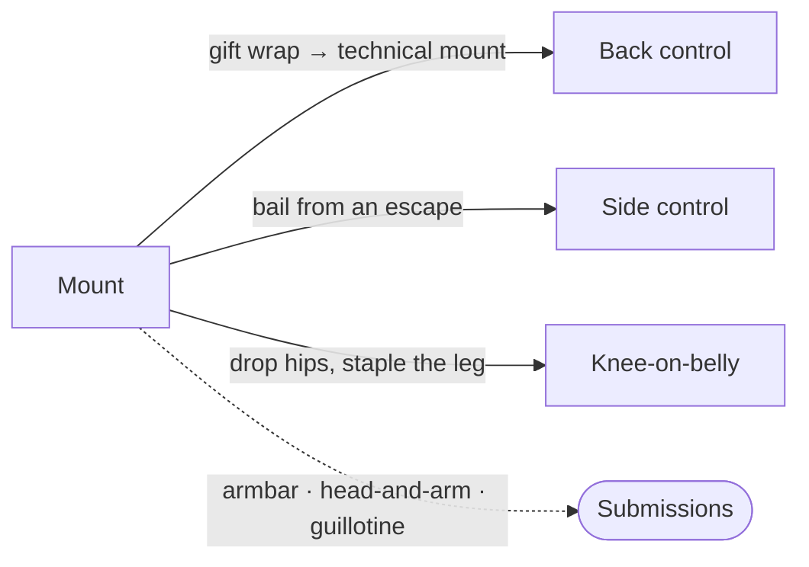

# Mount — Building Pressure and Finishing

Mount is one of the most dominant positions in jiu-jitsu. You are sitting on top of your opponent's torso with your knees on either side of their body. Gravity works for you, submissions are plentiful, and your opponent's options are limited to escape attempts — each of which, if you are prepared, opens up further attacks.

The key principle of mount: you are not trying to force a submission on a flat, defensive opponent. You are trying to make them uncomfortable enough to react, and then you capitalize on their reaction. Everything in this page flows from that principle.

All descriptions assume you are on top in mount.

---

## From Here

Where this position leads. Details for every arrow are in the sections below and in the [position map](../position-map.md).

---

## 7.1 Making Them React

When your opponent is flat on their back in mount with their arms tucked tight to their chest, there is not much you can do directly. You could try to pry an [americana](../submissions.md#114-americana) by rolling one of their arms down, or slowly work a [head-and-arm choke](../submissions.md#118-head-and-arm-choke) by inching their elbow up. But these are grueling against a tight defense.

The better approach: create discomfort that forces them to move.

### The Crossface Pressure

To get your opponent to turn to their left side: snake your left arm under their head and drive your shoulder across their jaw (the [crossface](01-foundations.md#13-the-crossface)), turning their head. Post your right arm out as far as you can and drop your weight to their left (your right). This compresses their neck and is deeply uncomfortable.

Because your left arm is under their head (not posted on your left side), they cannot shrimp to your left — you have eliminated that escape direction by controlling their head. You are essentially daring them to react to the pressure.

**A subtlety on commitment:** Keep the crossface somewhat loose. If you reach all the way under and grip their far armpit to cinch it tight, you commit your arm in a way that exposes you to a reversal — they can pull down on your shoulder, clear their jaw, and shrimp the other direction to knock you over. Loose enough to control, tight enough to be uncomfortable.

### What Happens When They React

Your opponent will usually do one of three things:

**They turn to their side and reach.** If they turn onto their side and reach toward your right arm or toward your body, feed their arm to your left hand, get into the [gift wrap](#the-gift-wrap-to-back-control) position (their arm across their face, controlled by your grip), slide your left knee behind their back for technical mount, and roll them into back control. This is the ideal outcome — you are always watching for it.

**They attempt the hip escape.** They post on your right hip with their foot and try to push your right leg back to catch it in half guard. See [Section 7.3](#73-countering-mount-escapes) below.

**They try to bridge and roll.** They grab your body and try to bridge explosively to flip you. The crossface makes this very difficult because they cannot turn their head in the direction they need to bridge. Stay heavy, keep the crossface, and ride the bridge.

---

## 7.2 Attacks from Mount

### The Head and Arm Choke to Armbar

This is a methodical sequence for when your opponent is flat with their arms tight. It uses the head-and-arm choke as a setup for the [armbar](../submissions.md#111-armbar) — the choke creates the positional control that the armbar needs.

**Step 1: Walk the elbow up.** Place your right arm between their left shoulder and neck, behind their neck. Snake your left arm under their right elbow. Gradually walk their right elbow upward — lifting your elbow, then pushing forward on the downstroke, repeating. They will be pushing down hard. Work methodically until their right arm is pressed against their right ear.

**Step 2: Link up.** Bring your left arm under their head, potentially linking with your right arm in a gable grip. You now have a head-and-arm configuration.

**Step 3: Slide to S-mount.** Because your left arm is under their right arm, there is space to slide your left knee under their right shoulder. Swivel so you are sitting on their ribcage with your left knee tucked under their shoulder, eyes pointed perpendicular to their body, leaning toward their feet. Use the gable grip to raise their head slightly if you need to sink the knee deeper.

**Step 4: Transition to the armbar.** Lean and sit toward their feet. Bring your left arm from behind their head around to control their arm. Flip your left leg over their head, and sit back — squeeze them toward your body rather than just straightening your legs. You are in the armbar.

This is the spine of the [mount submission chain](../chains/06-mount-submission.md).

### Breaking Armbar Defenses

Once you have the armbar locked in from mount, your opponent will typically attempt one of two defenses:

**The gable grip defense.** They clasp their hands together and press the grip against their chest, using their far elbow to lever under your leg and prevent you from pinching your knees. Counter: lace your arm under their trapped arm, reach up and grab their far elbow, and pull it across your body to reduce their leverage. Simultaneously punch with your other fist toward their head in a key-lock motion to twist their arms apart. If the grip persists, use both hands to push the punching fist further. Once the grip breaks, immediately sit back diagonally toward their feet.

**The crossed-arm defense.** They grip their own elbow with their far hand and try to turn, pulling their elbow down between your legs to escape. Counter: attack the other arm instead. Grip behind their far elbow with your near arm, drag it across, drop your leg from their face to above their head in a flattened S-mount, and pivot across their body to the armbar on the opposite side.

### The Armbar from Mount (Direct Entry)

If your opponent's right arm is crossed in front of their left: pass your right arm under their right wrist and snake it over their right tricep. Drag their arm slightly across their body, raising their right shoulder off the mat. Collapse your chest onto their arm, pinning it between your chest and theirs.

Slide into technical mount: left knee up under their right shoulder near their ear. Pivot perpendicular, eyes facing their left side. Sit your weight down in S-mount with their arm laced by your right arm. Sit toward their left foot — this raises your left knee and hip, letting you throw your left leg over their head easily. Sit back into the armbar.

### The Guillotine from Mount

Finishing principles for all guillotines are in [Section 9.4](09-front-headlock.md#94-the-guillotine) and the [submissions index](../submissions.md#116-guillotine).

When your opponent shrimps onto their side and attempts the knee-elbow escape — reaching toward your hip to push your leg down — their neck is exposed.

If they are on their left side: immediately wrap your right arm around the back of their neck, drop your right hip to the mat, and grab your right wrist with your left hand for the guillotine grip.

Do not flip onto your back to finish. Instead, while on your side with their head in the guillotine, scoot your right hip to create a small gap between your body and theirs. Your opponent will push into that gap — and when they do, drop into the guillotine finish, keeping your left leg over their back to prevent escape.

**The bail-out option:** If they hand-fight fast enough to prevent the guillotine from sinking, do not commit to dropping to your hip. Slide back into mount and maintain the dominant position. The mount is always worth more than a loose submission attempt.

### The Gift Wrap to Back Control

When your opponent turns to their side from mount — whether from your crossface pressure or their own escape attempt — and their arms are tight near their head:

Snake your left arm behind their head and grip their left wrist. They will think you are going for a key lock (which you cannot finish from behind their head). When they reach with their right arm to break your grip, briefly pin their right arm with your right hand and feed it to your left grip. Their right arm is now across their face, right wrist controlled by your left hand.

Snake your right hand under their right arm and up to grip your own left wrist — a [kimura](../submissions.md#113-kimura)-like control grip. This gives very strong control over their arm across their face.

From here, slide your left leg behind their back (left foot in the small of their back), and rock them to your right using your left leg as a pivot. They end up on their weak side in deep back control with the gift wrap locked in.

**From the gift wrap in back control:**
- **Armbar:** Move your left leg over their left shoulder *first* (critical — skipping this lets them reverse you), then drop back and bring your left leg over their head for the armbar.
- **Reverse triangle.** Also available from here — see [The Reverse Triangle from Back Control](08-back-control.md#the-reverse-triangle-from-back-control).

---

## 7.3 Countering Mount Escapes

### The Hip Escape Counter

When your opponent posts on your right hip with their foot and tries to push your right leg back to catch it in half guard:

**The hip drop and ankle clear.** Drop your hips and swivel to your right hip so your right hip hits the mat and your left knee lifts slightly. This pulls your right ankle far away from their reaching foot — there is nothing to catch. They have committed their right leg across their body. Swivel back, bring your hips up, and use your right ankle to staple their extended right leg to the ground. Their hips are now twisted. Bring your right leg back to their left side, execute knee-on-belly with your right knee across their stomach, and drop back into mount.

**The side control bail.** Instead of dropping your hips, straighten your right leg and swing it back and around so you land in [side control](06-side-control.md) on their right side. The danger: they may shrimp onto their right side in response. Prevent this by crushing your hips down as you rotate — do not lift your leg up; drop your hips, which elevates the leg and lets it swivel while keeping them compressed. Land low on their body near their hip line — if you are too high, they can underhook your shoulder and wrestle up.

### The Quarter Guard Recovery

If they do catch your right leg in quarter guard from mount: use your right arm to get head control, turning them with a crossface. Drop your head to the mat on your left side, next to their head. All your weight is now on your left side — left arm posted, head left, left leg left. From this weighted position, raise your left shin and use it as a staple on their right inner thigh to pry their grip open and free your right leg back into full mount. Normally a staple from mount would let them sweep you, but with all your weight committed left, the sweep is nearly impossible.

---

## 7.4 Arriving at Mount

You do not just find yourself in mount. You get there through specific sequences covered in other pages:

- **From the knee lace:** Switch their knees, lace your left leg, crossface, clear your right knee past theirs, unlace into mount ([The Knee Lace to Mount](04-half-guard-top.md#the-knee-lace-to-mount)).
- **From quarter guard:** Half guard top, low pass with back exposure, through [quarter guard](04-half-guard-top.md#45-the-low-pass-with-back-exposure) into mount ([Section 4.5](04-half-guard-top.md#45-the-low-pass-with-back-exposure)).
- **From side control:** [Walk your knees across](06-side-control.md#side-control-to-mount), or use the [heart choke transition](06-side-control.md#the-heart-choke-from-side-control) ([Side Control](06-side-control.md)).
- **From sweeps:** [Pendulum sweep](02-closed-guard.md#the-pendulum-sweep), [shoulder clamp sweep](05-open-guards.md#52-the-shoulder-clamp-system), [hip bump sweep](02-closed-guard.md#the-hip-bump-sweep) — all land you in mount ([Closed Guard](02-closed-guard.md) and [Open Guards](05-open-guards.md)).

---

## Summary

Mount is about pressure and patience. Make your opponent uncomfortable with the crossface, then capitalize on their reaction — the gift wrap to back, the head-and-arm to armbar, or the guillotine when they shrimp. When they try to escape, counter with the hip drop, the ankle staple, or the side control bail.

The most important discipline in mount: do not lunge for submissions. Secure the position, build pressure, and let your opponent's escape attempts create your openings. Position before submission — always.
