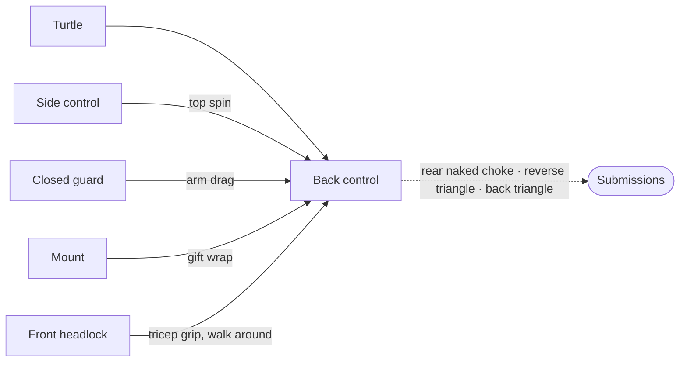

# Back Control and Back Takes

Back control is the most dominant position in jiu-jitsu. You are behind your opponent with your chest to their back, and they cannot see you. They have limited options for attacking, and you have access to chokes and controls that are extremely difficult to defend. Every positional chain in this reference — the [wrestle-up](../chains/02-half-guard-wrestle-up.md), the [turtle attack](../chains/03-turtle-attack.md), the [side control transition](../chains/05-side-control-pressure.md), the [mount gift wrap](../chains/06-mount-submission.md) — has back control as one of its highest-value destinations.

This page covers how to get there, how to stay there, and what to do once you have it.

---

## From Here

Where this position leads. Details for every arrow are in the sections below and in the [position map](../position-map.md).

---

## 8.1 Back Takes

The back is rarely taken in one move. It is reached through chains of technique that originate in other positions. Here are the primary paths, with references to where they are covered in detail.

### From Turtle (Primary Path)

Turtle is the most common route to the back. When your opponent defends the front headlock by turtling, you transition from attacking their neck to taking their back. This is covered in detail in [Turtle](10-turtle.md) (see [Section 10.5](10-turtle.md#105-the-primary-back-take-from-turtle)); the essentials:

Wedge your left knee between their left elbow and left knee, control their hip, hook your right leg behind their leg, and kick your left hook in as they fall — the full sequence is in [The Primary Back Take from Turtle](10-turtle.md#105-the-primary-back-take-from-turtle). If they try to roll out of it, see [Isolating the Far Arm](10-turtle.md#isolating-the-far-arm). The roll defense and the recovery if they do roll are below.

**The roll defense.** When you isolate their right arm by grabbing their wrist under their armpit, they may try to roll. This is dangerous — your head can get trapped and your neck strained. If you feel them starting to roll, hop to the opposite side. This removes the roll and lets you re-engage from the other side.

**If they do roll successfully:** Post your left hand to the right of their head to control the roll. You end up on your back with their shoulders on your chest, perpendicular to each other. Switch your grip: grab their right wrist with your left hand, release your right hand, and establish a [seatbelt grip](#82-the-seatbelt-grip) (left hand clasping over right fist). Walk your feet away from their body until you are parallel. Continue walking counterclockwise until you reach the technical seat position: left shin behind their lower back as a pivot, left knee up high toward their head. Step your right leg over their torso. Drop to your right hip and rock them over the pivot of your left shin — they fall onto their right side in deep back control.

### From Side Control

When your opponent shrimps to escape side control, the top spin technique ([Section 6.3](06-side-control.md#side-control-to-back--the-top-spin)) takes you directly to the back: step behind their head, spin 180 degrees, establish the seatbelt, and work for hooks.

### From Closed Guard (Arm Drag)

The arm drag from closed guard ([Section 2.2](02-closed-guard.md#the-arm-drag-to-back-control)) transitions to back control: drag their arm across, loop your arm around their bicep, sit up, reach around their back to their far armpit, get your near hook in, establish the seatbelt, and rock to your side.

### From Mount (Gift Wrap)

The gift wrap from mount ([Section 7.2](07-mount.md#the-gift-wrap-to-back-control)) leads to back control: feed their arm across their face, establish the kimura-like control grip, slide your leg behind their back, and roll them to their weak side.

### From Reverse De La Riva

After the swivel takedown from reverse de la Riva ([Section 5.3](05-open-guards.md#the-swivel-takedown)), if you cannot pass to side control, you can pivot toward their back — left arm to the outside of their hip, start positioning yourself behind them.

### From the Knee Pinch

From the knee slice position, pinching their knees together and hopping over exposes their back and creates a scramble that can lead to back control ([Section 4.8](04-half-guard-top.md#48-the-guillotine-feint-and-the-knee-pinch)).

---

## 8.2 The Seatbelt Grip

The seatbelt is your primary control grip from back control. One arm goes over their shoulder and around their neck (the choking arm), the other goes under their armpit (the underhook arm). Your hands clasp together.

**Critical detail:** Your top hand should clasp over your bottom fist. The choking hand (under the neck) is always underneath, protected by the top hand. When your opponent tries to break the grip, they will work on the top hand — the one they can see and reach. While their hands are occupied prying that top hand free, you can slip the bottom hand deeper around their neck and begin the choke.

### Strong Side vs. Weak Side

When you have the seatbelt and go to your side, the **strong side** is the side of the underhook arm (the arm under their armpit). If your right arm is over their shoulder and your left arm is under their armpit, your strong side is your left. Falling to the strong side keeps the choking arm on top, free to work toward the neck, while the underhook arm is on the bottom maintaining control.

### Elbow Positioning

A common mistake: letting your underhook elbow extend out in front of their chest. When you go to your side, your opponent can snake their arm around your elbow and trap it underneath them. This removes your ability to collapse their chest and transition to technical mount.

The fix: keep your underhook elbow tucked close to your own side. The underhook should be tight and short. The choking arm (over the shoulder) should be extended as far around their body as possible — that is the long arm of the seatbelt.

---

## 8.3 Maintaining Back Control

### Getting the Hooks

Once you have the seatbelt, you need hooks — your feet hooked inside their thighs to control their hips. The bottom hook (the one closer to the mat when you are on your side) is more important than the top hook. Without the bottom hook, they can easily turn into you and escape. The top hook is useful for control and for setting up submissions, but losing it is not immediately critical.

### When They Start to Escape

When your opponent begins to escape by clearing their hips, flattening their shoulders to the mat, and scooting their back along the ground:

Hold the seatbelt tight. Step your top leg (say your left leg) over their hips. Put pressure with your left shoulder collapsing over their left shoulder. Bring your right knee up as far as you can — all the way behind their head. Tuck your right foot against the small of their back.

Your left hip should be elevated at this point. Sit up and back in the direction of your left hip. This turns them around so they are on their left side, lower toward your legs, and you naturally have your left hook in. You are back in dominant position.

### Transitioning to Technical Mount / Chair Sit

If your opponent is not turtling up or actively escaping, you can improve your position. Bring your right knee flush against their upper back, right ankle flat against their mid-back — get it as high as possible. Step your left leg over their torso into the chair-sit position. From here, rock back into deep back control where they are low between your legs, and attack.

---

## 8.4 Submissions from the Back

### The Rear Naked Choke

The [rear naked choke](../submissions.md#1111-rear-naked-choke) is the highest-percentage submission from back control. The setup: your choking arm (say your right arm) slides under their chin, wrapping around their neck. Your left hand grips your right bicep. Your right hand goes behind their head. Squeeze your elbows together.

The challenge is getting the arm under their chin. Your opponent will tuck their chin and use their hands to fight your choking arm. This is where back control maintenance matters — if your seatbelt grip is strong and your hooks are in, you can be patient and work the arm in over time.

### The Reverse Triangle from Back Control

An extremely strong option available from the gift wrap back take ([Mount](07-mount.md#the-gift-wrap-to-back-control)). With your opponent on their side in the gift wrap: bring your left leg over their left shoulder. Give up the gift wrap grip and use your right arm to grip your left ankle, trapping their arm and neck between your left leg and right arm. Put your right leg over your left ankle and cinch. The reverse triangle is stronger than a forward triangle because the opponent cannot posture up to escape.

### The Back Triangle

From the technical seat / chair-sit position with the seatbelt grip: bring your left leg up over their left shoulder while maintaining the seatbelt. Grip your left ankle with your right hand (letting go of the seatbelt). Rock their body to your left using your hips, then bring your right leg up over your left ankle and cinch the backward triangle. To strengthen it, snake your right foot behind their back for leverage and squeeze your knees together.

### Hip Block and Twister Concepts

From back control in the seated position, you can work toward a hip block or twister. Check your ruleset — both techniques are restricted or banned at many belt levels, and the twister is illegal under some rulesets at every belt. These are good positions to understand even if you cannot apply them in competition, because they create pathways to rear naked choke variations.

---

## Summary

Back control is the destination that justifies many of the technique chains in this reference. You get there from turtle attacks, side control transitions, mount gift wraps, arm drags, de la Riva sweeps, and scrambles. You stay there with the seatbelt grip (choking hand underneath, underhook elbow tucked), hooks (bottom hook is priority), and the re-establishment technique when they start to escape.

From back control, the rear naked choke is the primary submission, but the reverse triangle and back triangle are powerful alternatives. And if you cannot finish, the position itself is so dominant that simply maintaining it — being patient, keeping your hooks, waiting for the opening — is a winning strategy.
