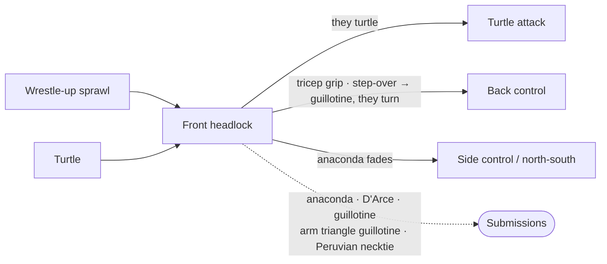

# The Front Headlock and Head-and-Arm System

The front headlock is one of the most distinctive positions in this reference. It is where several of the highest-value attacks converge — the anaconda, the D'Arce, the guillotine, and the transition to back control — and it is a position that connects naturally to the [wrestle-up](03-half-guard-bottom.md#35-the-wrestle-up) from half guard, the [turtle attack](10-turtle.md), and even the [knee slice](04-half-guard-top.md#42-the-knee-slice).

If you are someone who likes to wrestle up from bottom positions and attack from the top, the front headlock is where your game comes together. Your opponent wrestles up and you sprawl. They turtle and you threaten the neck. They defend the neck and you take the back. Every path through the front headlock leads somewhere good.

This page covers the position itself, the submissions available from it, and — equally important — how to escape when you are the one caught in it.

---

## From Here

Where this position leads. Details for every arrow are in the sections below and in the [position map](../position-map.md).

---

## 9.1 The Front Headlock Position

The front headlock is a position where you are facing your opponent, their head is below your chest, and your arms are controlling their head and one of their arms. The classic configuration: your left arm is wrapped around their head, your right arm is under their left armpit, and your hands are clasped in a gable grip.

### How You Get Here

**From the wrestle-up** ([chain](../chains/02-half-guard-wrestle-up.md))**.** When your opponent is on bottom in half guard and wrestles up with the underhook, you sprawl to stop their advance. If your sprawl is effective, you end up in a front headlock position with their head below your chest. This is the most common entry. The wrestle-up itself is covered from the bottom player's perspective in [Section 3.5](03-half-guard-bottom.md#35-the-wrestle-up).

**From turtle attacks** ([chain](../chains/03-turtle-attack.md))**.** When your opponent turtles to defend a pass or a front headlock attempt, you end up in a position to attack their neck from above. See [Attacks from Turtle Top](10-turtle.md#104-attacks-from-turtle-top) for what follows.

**From failed guard passes.** When your opponent tries to pass your guard and you scramble, you can sometimes catch their head on the way up and establish the front headlock.

**From the half guard wrestle-up defense.** When you are in bottom half guard and your opponent beats your knee shield, the two-on-one wrist control to whizzer technique ([Section 3.3](03-half-guard-bottom.md#33-the-knee-shield)) takes you from half guard bottom directly to the front headlock.

### Winning the Arm: The Step-Over

Almost everything from the front headlock — the anaconda, the D'Arce, the head-and-arm, the back take — depends on dragging their left arm across their center line. They know it, and they fight it. You have both hands clasped on the back of their left tricep, and the arm is not moving.

When a grip will not come, threaten something else.

**The threat.** Step your left leg *over* their head. If they do not react at all, throw your right leg over their back and go for the Peruvian necktie — a low-percentage finish, but a real one, and it is what makes the threat honest. Almost everyone reacts, though: they push at the leg over their head to get it off.

**What is really happening.** While they are busy with your left leg, your right knee — which was on the mat — walks closer and closer to their left arm, and starts helping push that arm across their center line. They rarely notice. They are worried about the necktie and the leg on their head, and read the right knee creeping in as part of the same movement. It is not. It is what lets you cinch the grip on the left tricep and finally bring the arm across.

**The drop.** When they shove your leg off their head, let the momentum carry you: switch your legs — left and right both to their left side — and fall to your back, straight into a tight arm triangle guillotine, the arm you just won trapped inside the choke with the head (the grip and finish are in [The Arm Triangle Guillotine from Front Headlock](#the-arm-triangle-guillotine-from-front-headlock)). On its own this is a high-percentage finish.

**When they turn away.** More experienced opponents defend the arm triangle guillotine by turning away from the choke, so their back faces you. Give up the choke immediately. Take your right arm and wrap it under their right shoulder — the one now exposed to you — and pull that shoulder tight to your chest. Kick through on their left side with your left leg, and you have their back ([Back Control](08-back-control.md)).

The full front headlock system, with this branch in it, is drawn in [chains/12-front-headlock.md](../chains/12-front-headlock.md).

---

## 9.2 The Anaconda Choke

Finishing mechanics: [Submissions § Anaconda and D'Arce](../submissions.md#117-anaconda-and-darce).

The anaconda is the submission that comes up most naturally from the wrestle-up and turtle attack positions, and the one the rest of this page is built around.

### Setup

From the front headlock with the gable grip (left arm around their head, right arm under their left armpit, hands clasped): your goal is to drag their left arm across their face. This weakens their shoulder and brings their arm closer to their head, closing the space the choke needs.

**The grip detail that matters:** Clasp your hands in a gable grip behind their left tricep. Bring your right elbow down near their left elbow and sweep it across their body. At the same time, pull them forward toward you — this stretches them out, takes the power out of their legs and back, and prevents them from basing strongly on their knees.

### The Roll-Through

Once their arm is dragged across and they are stretched forward: transition your grip. Release the gable grip and clasp your left hand on your right bicep, with the blade of your right wrist against the right side of their neck. This is the anaconda configuration. Roll through — lead with your right shoulder, dropping your head to your right side and rolling over your right shoulder. They come with you.

**The pre-sink approach:** It is more effective to establish the bicep grip *before* you roll through, rather than rolling and then trying to sink the choke. If you keep both hands on their tricep while rolling, their elbow stays controlled and they cannot base out. However, the choke is tighter if you have already transitioned to the bicep grip before the roll.

### Finishing

After the roll-through, you are on your left side with them on their right side, the anaconda locked around their head and arm. The finish comes from closing the aperture — the space between your body and your left arm. Squeeze your elbows together and bridge into them.

### When the Anaconda Does Not Finish

This happens. You have rolled through, the choke is deep, but your arms are tiring and they are defending. You have options:

**Transition to a strong position.** Rather than burning your arms on a fading choke, release your left hand from your right bicep, grip the back of their left tricep with it, and start getting to your knees. You can transition to [north-south](06-side-control.md#side-control-to-north-south) or side control from here — they are still on their back in an awkward position, so you should be able to establish a dominant position.

**Do not transition to a guillotine.** The temptation is to switch to a guillotine from the anaconda position, but it rarely works well. You are already on your left side with your left arm forced upward, making it difficult to bridge and create the space needed for a proper guillotine. The positional transition above is more reliable.

---

## 9.3 The D'Arce Choke

The D'Arce is an alternative to the anaconda that can be more natural to finish, particularly from side control or when your opponent is on their side.

### D'Arce vs. Anaconda

Both chokes use a figure-four grip around your opponent's head and arm. The difference is the threading direction:
- **Anaconda:** Your arm goes around their head first, then around their arm. You typically roll through to finish.
- **D'Arce:** Your arm goes under their armpit first, threading across their neck to the far side. You typically finish from the side without rolling.

The D'Arce is often available when the anaconda is not, and vice versa.

### Setup from the Front Headlock

From the north-south turtle position, with both hands on their left tricep and your left arm around their head: slip your right arm under their armpit and through to the right side of their neck. Gable grip your left hand with your right, positioning your left wrist behind their head — almost like a half Nelson.

Push their head down toward your right hip and fall to your left side. They fall onto their right side. Now transition to the classic D'Arce: slide your left arm up so your right hand grips your left bicep, with the blade of your right wrist pressed into the right side of their neck. Sprawl back on your right hip, bringing your chest down on the left side of their head, crushing their arm and head together. The pressure is tremendous.

### Setup from Side Control

When your opponent shrimps onto their side and reaches for the underhook with their left arm (the same position that opens up the guillotine): wrap your right arm around their left arm and thread it across their neck to the far side. Use your left arm and elbow to push their head down, encouraging them to crunch. Thread your right arm completely through. Grip your left bicep with your right hand for the figure-four.

The D'Arce from side control does not require a roll-through like the anaconda. Grab one of their legs to prevent escape, cinch the figure-four, and bring your chest in to close the space. You can also transition to mount for additional finishing pressure.

See [Section 6.2](06-side-control.md#the-darce-choke) for the side control context.

---

## 9.4 The Guillotine

Index of every entry: [Submissions § Guillotine](../submissions.md#116-guillotine).

The guillotine appears from more positions than any other submission in this reference — from closed guard, from mount, from side control, from the front headlock, and from the knee slice. This section covers the entries and finishing principles; position-specific setups are cross-referenced to their home pages.

### The Provocation Guillotine from Front Headlock

From the front headlock with a gable grip, begin pulling their left arm across their face as if setting up the anaconda. Your opponent will resist by pushing back with their left elbow to create space.

When they push out with their elbow — overreacting to your pull — release the gable grip, swim your right arm around their left shoulder, and secure a classic guillotine around their neck. Because you cleared their shoulder, only their neck is in the choke (not their arm), making it a more powerful finish than an arm-in guillotine.

Lock it in, fall back, and apply.

### The Arm-In Guillotine from Side Control

When your opponent shrimps in side control and works for the underhook: wrap your left arm around their neck, your right arm around their left arm, and clasp into a gable grip. Drop onto your left hip and lean slightly forward.

**The finishing principle:** Do not arch back. This creates space and lets them escape. Instead, position their head between the ground and your body, and move sideways across their neck. Let gravity close the aperture. Dig your chin into the back of their neck and scoop forward. Use your right leg to push back and circle as they push forward, maintaining side position while the grip tightens.

This is how the best practitioners finish guillotines — coming forward, not pulling back. (See [Section 6.2](06-side-control.md#the-arm-in-guillotine).)

### The Guillotine from Mount

When your opponent shrimps onto their side and reaches for your hip to attempt the knee-elbow escape, their neck is exposed. Wrap your arm around the back of their neck, drop to the hip, and establish the guillotine grip.

Scoot your hip to create a small gap, let them push into that gap, then drop into the finish with your top leg over their back. (See [Section 7.2](07-mount.md#the-guillotine-from-mount).)

### The Hip Bump to Guillotine

From closed guard, after the hip bump sweep is defended by your opponent driving forward: bring your kicking leg back, sit back, and wrap the guillotine around their exposed neck. (See [Section 2.2](02-closed-guard.md#the-hip-bump-sweep).)

### The Guillotine Feint from the Knee Slice

Used as misdirection to pass into mount rather than as a finish — see [Section 4.8](04-half-guard-top.md#48-the-guillotine-feint-and-the-knee-pinch).

---

## 9.5 Head and Arm Submissions

Mechanics: [Submissions § Head and Arm Choke](../submissions.md#118-head-and-arm-choke).

### The Arm Triangle Guillotine from Front Headlock

This is the finish the [step-over](#winning-the-arm-the-step-over) drops into, reached here directly once the arm is across. From the front headlock with the gable grip, after dragging their left arm across their body: switch your grip so your left arm holds their left tricep and your right hand holds your left wrist. Slide your left knee down, drop, and throw your right leg over their back. Pull back as you would in a guillotine, keeping their head and the trapped arm inside together. If they turn away from it, take the back — see [When they turn away](#winning-the-arm-the-step-over).

### The Head and Arm Choke to Armbar from Mount

From mount, methodically walk their elbow up to their ear, link up the gable grip behind their head, slide your knee under their shoulder into S-mount, and transition to the armbar. (See [Section 7.2](07-mount.md#the-head-and-arm-choke-to-armbar) for the full sequence.)

### Transition to Back Control from Front Headlock

From the gable grip with their arm pulled across: release the grip, clasp both hands onto the back of their left tricep, and walk yourself onto their left side and around their back. You are now in the turtle attack position — run the [primary back take](10-turtle.md#105-the-primary-back-take-from-turtle), and note the [roll danger from an early seatbelt](10-turtle.md#transitioning-from-front-headlock-to-turtle-attack).

---

## 9.6 Escaping the Front Headlock and Head-and-Arm

When you are caught in a front headlock, escaping is urgent — the anaconda, D'Arce, and guillotine are all moments away.

### The First Principle: Hand Fight

Before anything else, hand fight. This buys you time. Your opponent is trying to pass your head to the armpit on either side — keep your head centered, ideally under their chest. As long as your head is on center line, the chokes are harder to lock in.

### Escape Toward the Armpit Side

Always escape toward the side where their arm is under your armpit, not toward the side where their arm is around your neck. If their right arm is around the left side of your neck and their left arm is under your right armpit, escape toward their left side (your right).

### Two Escape Techniques

**If their hips are moving toward your escape side:** Reach with your left arm and grab their far leg (left leg) in a single leg. Advance, drop your elbow behind their calf so they cannot improve position, and wrestle up. Grab their other leg if possible and work to gain top position.

**If their hips are moving away from your escape side:** This is the duck-out. Grab their near leg, step up, kick, and baseball slide — hip on the floor, sliding away from your opponent. Keep your head under their armpit with good posture (look at the ceiling — if you drop your head, they can recatch you). Turn toward their hips, never toward their head. Turning toward their head means a 360-degree trip to get back to a useful position; turning toward their hips puts you at their side or even behind them.

---

## Summary

The front headlock is where the wrestle-up game pays its dividends. From this position, the anaconda, D'Arce, and guillotine are all available — and when those do not finish, you have clean transitions to side control, north-south, and back control. From the defensive side, the principles are simple: hand fight, keep your head centered, and escape toward the armpit.

This system connects backward to the half guard wrestle-up ([Half Guard Bottom](03-half-guard-bottom.md)), the turtle attack ([Turtle](10-turtle.md)), and the side control shrimp escape defense ([Side Control](06-side-control.md)). It connects forward to back control ([Back Control](08-back-control.md)) and the submissions reference ([Submissions](../submissions.md)). The front headlock is not a dead end — it is a hub.
