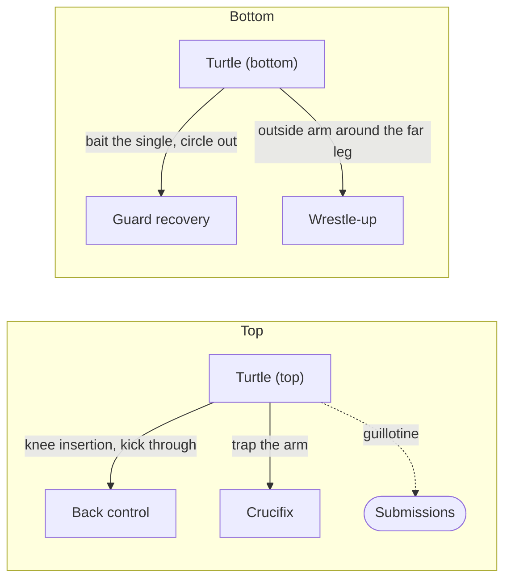

# Turtle — Attacking and Defending

Turtle is a transitional position that connects many other pages. Your opponent is on all fours with their head down, knees on the mat, and elbows tucked — presenting as little surface area as possible. You arrive at turtle from sprawling on a [wrestle-up](03-half-guard-bottom.md#35-the-wrestle-up), from defending a [front headlock](09-front-headlock.md), from a failed guard pass, or from any number of scrambles. The decision tree is drawn in [chains/03-turtle-attack.md](../chains/03-turtle-attack.md).

Turtle is not a destination. It is a fork in the road. From the top, you can take the back, attack the front headlock system, hit a crucifix, or set up a guillotine. From the bottom, you can recover guard, initiate a single leg, or scramble to a better position. The key on both sides is knowing which path to take and when.

All descriptions assume you are attacking from your opponent's left side, with your right hip against their left hip. (Most other pages default to attacking the opponent's right side; this page uses the left so that it matches [Back Control §8.1](08-back-control.md#from-turtle-primary-path) and the [turtle attack chain](../chains/03-turtle-attack.md). The techniques are mirror images.)

---

## From Here

Where this position leads. Details for every arrow are in the sections below and in the [position map](../position-map.md).

---

## 10.1 The Golden Rule: Do Not Overreach

The single most important lesson when attacking turtle: stay on your side. Do not reach across to the far side of your opponent's body.

If you reach your right arm under their right armpit trying to pry them toward you, they can clamp down their right elbow, trap your arm, and roll you. Your neck can get caught in the roll, and they can end up in a dominant position on top of you. This is a real risk, and a dangerous one.

Instead, keep your weight firmly on their left side. Everything you do — the knee insertion, the choke threats, the back take — happens on the side you are already on.

---

## 10.2 The Starting Position

You are on your opponent's left side. Your left foot is on the mat, driving your weight into the left side of their body. Your right hip is against their left hip. They are turtled: head down, knees and elbows on the mat.

The first move is always the same: **threaten the choke.** Take your left hand and start testing the choke by trying to slip it under their chin. They will fight this off. That is fine — the choke threat is the setup, not the finish. When they defend the choke, they create the openings for everything else.

---

## 10.3 The Knee Insertion

When you threaten the neck with your left arm, your opponent will typically bring their left arm up to defend the neck wrap. This lifts their left elbow — and creates the space to slide your right knee between their left elbow and left knee.

Getting the knee in is the critical step. From here, you have several options.

There is a second variation: inserting your *left* knee between their left elbow and left knee instead of your right. To get it there, check the neck and threaten the choke to widen the gap. That is the start of the primary back take — see [Section 10.5](#105-the-primary-back-take-from-turtle).

The right-knee insertion leads to the [crucifix](#the-crucifix); the left-knee insertion leads to the [primary back take](#105-the-primary-back-take-from-turtle).

---

## 10.4 Attacks from Turtle Top

### The Crucifix

After inserting your right knee between their left elbow and left knee: trap their left arm with your left leg. Clamp down on it, pull it back behind your right leg, and squeeze your legs together. Their left arm is now trapped between your legs in the crucifix position.

From the crucifix you have multiple attacking options, including a roll-through to expose their neck and chest. The crucifix is a controlling position — once you have it, they are in serious trouble.

### The Guillotine

If your opponent is wise to the crucifix and tries to avoid it by reaching around your hips to work toward your back, that reaching arm exposes them perfectly for a guillotine. Turn your hips, wrap your left arm around their neck, and the [arm-in guillotine](09-front-headlock.md#94-the-guillotine) is practically sunk in because they have left their arm extended and vulnerable.

### Isolating the Far Arm

If your opponent is roughly your size or smaller, you can reach around their body with your right hand under their right armpit and grab their right wrist. This isolates their right arm and removes their base on that side.

**Warning:** Isolating the arm by grabbing the wrist naturally removes their base on the right side, which almost invites them to roll. Be prepared. If they start to roll:

- Post your left hand to the right of their head to control the roll
- Look to your left (the natural direction your head will turn as you roll over your right shoulder)
- You will end up on your back with their shoulders on your chest, perpendicular to each other, with control of their right wrist

From this position, switch to a [seatbelt grip](08-back-control.md#82-the-seatbelt-grip) (see [Section 8.1](08-back-control.md#from-turtle-primary-path) for the full recovery sequence: walk your feet to parallel, continue counterclockwise to the technical seat, step over their torso, and rock them into deep back control).

If you sense they are about to roll *before* you are ready, hop to the opposite side. This takes away the roll entirely.

If they do not roll, continue: reach across with your right arm under their right armpit and grab their left wrist — this collapses their left shoulder toward the ground. Wedge your left knee between their left elbow and left knee. Bring your weight down without dropping your hip to the mat — this puts maximum pressure on their collapsed shoulder. Kick through their left knee with your left leg to extend their leg and roll them onto their back. Get your left hook in immediately — the bottom hook is far more important than the top hook, because without it they can scramble free.

---

## 10.5 The Primary Back Take from Turtle

This is the highest-percentage back take from turtle and the one the rest of this page builds on. It is relatively safe — no jumping over, no rolling through. You work on the side you have and control their hips.

### The Sequence

1. **Threaten the choke** with your left hand under their chin. They defend.
2. **Wedge your left knee** between their left elbow and left knee.
3. **Cup behind their neck** with your left hand and drive your elbow to the mat. This raises their hips.
4. **Drop to your left hip.** Push your left knee into their left knee to push their leg away from their body.
5. **Right hand on their right hip,** pulling them tight into your body. This prevents them from rolling.
6. **Work your right leg** to hook behind their left leg. Continue kicking your left leg to push their left leg further away if needed.
7. **Once the hook is in,** move your right arm from their right hip up to their right shoulder, clamping tightly against your chest. This prevents them from rolling in either direction.
8. **Switch your left hand** from behind their neck to around their head, with your left wrist across the left side of their neck, looking for control or a choke.
9. **As they fall to their left side** with your right hook in, kick your left leg through to get your left hook around their left leg. You are now in back control.

Once you have the hooks, see [The Seatbelt Grip](08-back-control.md#82-the-seatbelt-grip) and [Maintaining Back Control](08-back-control.md#83-maintaining-back-control).

### The Granby Roll Defense

A strong opponent may try to Granby roll out of turtle over their left hip to escape. But with the hook in and their right hip controlled by your right hand, you can pull them into the pocket of your hips with their back against your chest. The roll fails.

### Transitioning from Front Headlock to Turtle Attack

When someone defends your [front headlock](09-front-headlock.md#91-the-front-headlock-position) by turtling: pivot 180 degrees so your head faces the same direction as theirs and your chest is against their lower back. You are now in turtle top position. Start [the sequence above](#the-sequence) — threaten the choke, wait for the defense, and work for the back.

**The roll danger from seatbelt:** If you get the seatbelt grip too quickly from behind, they can pinch your wrist in their armpit and roll to transition to side control. If you feel them securing that grip on your wrist, hop to the opposite side immediately.

**Starting from behind them (parallel).** If you end up with your chest to their back, head facing the same direction, without the seatbelt — start by threatening the choke with your far arm. When they reach to defend, feed their far wrist to your near arm's grip. Collapse their shoulder, wedge the knee, kick through the leg, insert the hook.

---

## 10.6 Bottom Turtle — Defending and Escaping

### From North-South (Opponent Facing Your Head)

When your opponent has double underhooks from the north-south turtle position, your goal is to recover guard or wrestle to a better position.

**The single leg bait.** Reach your right arm around the outside of their left leg — not the inside. Reaching inside lets them trap your arm between their legs by circling perpendicular to you and working to a [crucifix](#the-crucifix). Reaching outside is safer.

If they sprawl in response to your leg grab (the most common reaction), use it: circle your legs underneath you, pivot on your right hip, and swing your legs 180 degrees. You can recover [half guard](03-half-guard-bottom.md), [closed guard](02-closed-guard.md), or even [butterfly guard](05-open-guards.md#51-butterfly-guard) in the space their sprawl created. This is the most common and most practical escape from bottom north-south turtle.

If they do not sprawl, draw your body in close, circle your knees 90 degrees to their left side so your ear is in the pocket of their hip (keeping your neck safe), then bring your left arm through to clasp hands for the single leg. Swing your right leg over their left leg to keep them from circling away, and wrestle up.

### When They Are on Your Side

If your opponent has progressed to your side with their knee inserted between your elbow and knee, the temptation is to reach for their far leg (the one up on its foot). This is a trap — they can use it to work to the [crucifix](#the-crucifix).

Instead, you need their near leg — the one whose knee is currently between your elbow and knee. Work your elbow around their knee, which may require circling and movement, and then attack that single leg from the side.

### The General Principle

From bottom turtle, the priorities in order are:
1. Protect your neck (tuck your chin, keep elbows tight)
2. Recover guard (circle out when they sprawl)
3. Attack a leg (single leg from the outside, not the inside)
4. Wrestle up if you get the single leg

---

## Summary

Turtle is a position you pass through, not one you stay in. From the top, the sequence is always: threaten the choke, create the opening, insert the knee, and work to the back. Stay on your side, do not overreach, and control their hips. From the bottom, protect your neck, bait a reaction, and use their movement to circle out to guard recovery or attack a single leg.

The turtle connects directly to the front headlock system ([Front Headlock](09-front-headlock.md)) on the way in and to back control ([Back Control](08-back-control.md)) on the way out. When the front headlock defense is a turtle, your response is the back take. When the back take starts from turtle, the front headlock threatened the path there. These positions are a continuous loop.
